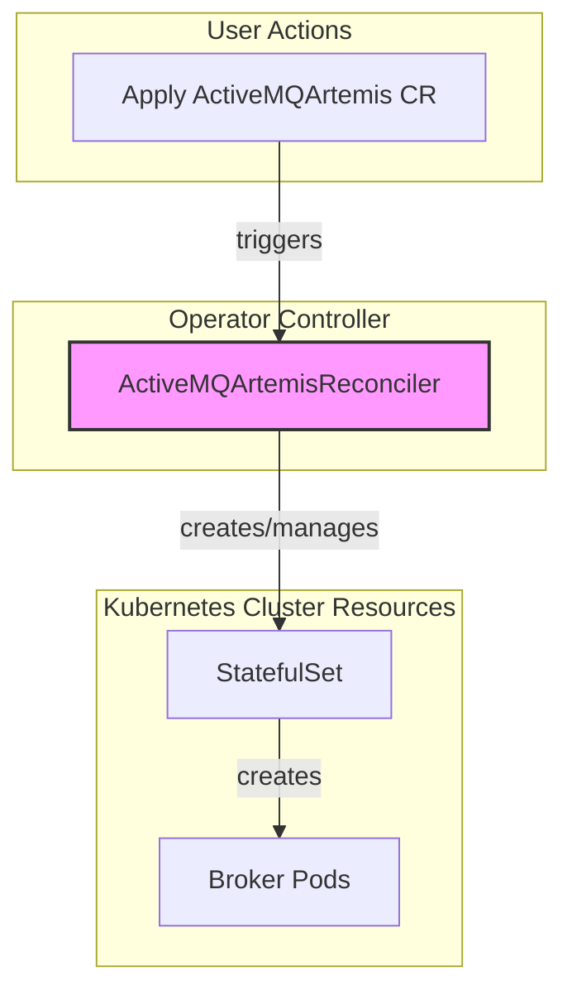
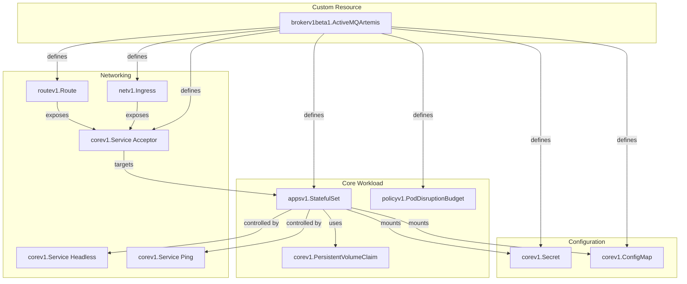
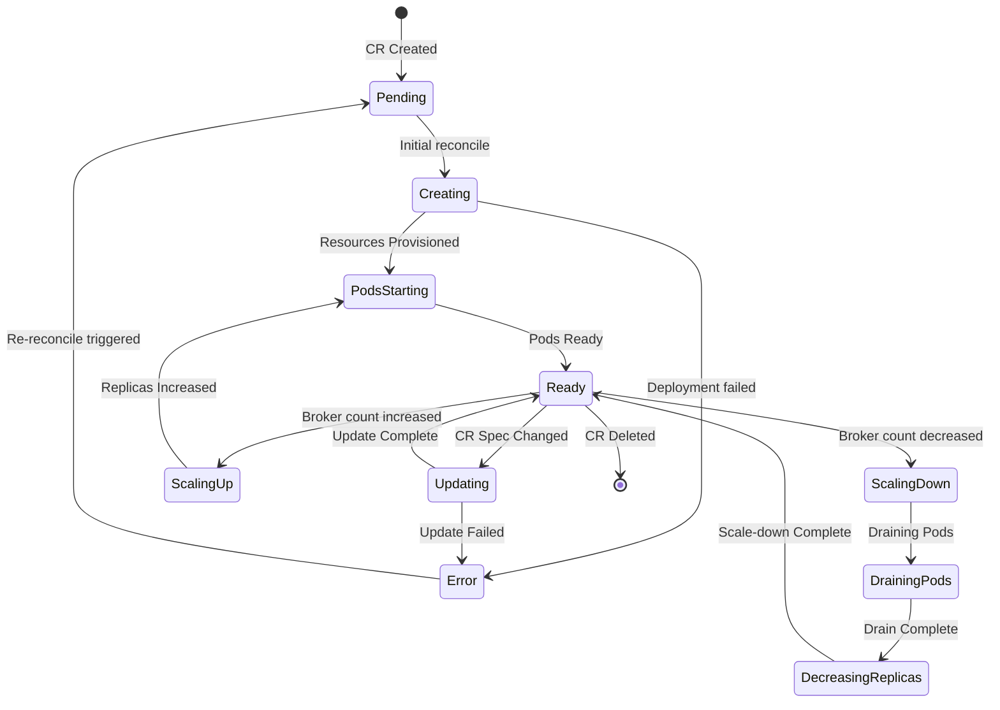

This document provides a comprehensive technical overview of the ActiveMQ Artemis Operator, intended for new developers. It covers the high-level architecture, the detailed logic of the main controller, its event-driven nature, and how it interacts with the cluster. The operator's entry point is [`main.go`](../../main.go), which sets up the controller manager and registers all reconcilers.

**Table of Contents**

1.  [High-Level Architecture](#1-high-level-architecture)
    *   [Reconciler Interaction](#reconciler-interaction)
2.  [Reconciler Logic and Flow](#2-reconciler-logic-and-flow)
    *   [Main Reconciliation Flow](#main-reconciliation-flow)
    *   [Managed Resources](#managed-resources)
    *   [Acceptor and Connector Configuration](#acceptor-and-connector-configuration)
3.  [Reconciler State Machine](#3-reconciler-state-machine)
4.  [Deprecated Custom Resources](#4-deprecated-custom-resources)
5.  [Configuring Broker Properties](#5-configuring-broker-properties)
    *   [How it Works](#how-it-works)
    *   [Basic Configuration](#basic-configuration)
    *   [Advanced Configuration](#advanced-configuration)
    *   [Practical Examples from Tests](#practical-examples-from-tests)
6.  [Restricted (Locked-Down) Mode](#6-restricted-locked-down-mode)
    *   [Overview](#overview)
    *   [Implementation Details](#implementation-details)
    *   [Configuration Example](#configuration-example)
7.  [StatefulSet Management and Resource Reconciliation](#7-statefulset-management-and-resource-reconciliation)
    *   [StatefulSet Creation and Updates](#statefulset-creation-and-updates)
    *   [Resource Templates and Strategic Merge Patches](#resource-templates-and-strategic-merge-patches)
    *   [Message Migration on Scale-Down](#message-migration-on-scale-down)
8.  [Metrics Implementation](#8-metrics-implementation)
    *   [Metrics Plugin Selection Logic](#metrics-plugin-selection-logic)
    *   [Legacy Mode Implementation (Artemis Metrics Plugin)](#legacy-mode-implementation-artemis-metrics-plugin)
    *   [Restricted Mode Implementation (JMX Exporter)](#restricted-mode-implementation-jmx-exporter)
    *   [Service Discovery and Port Naming](#service-discovery-and-port-naming)
9.  [Convention Over Configuration: Complete Conventions Reference](#9-convention-over-configuration-complete-conventions-reference)
    *   [Resource Naming Conventions](#resource-naming-conventions)
    *   [Platform Detection and Adaptation Conventions](#platform-detection-and-adaptation-conventions)
    *   [Persistence and Storage Conventions](#persistence-and-storage-conventions)
    *   [Service Discovery and Networking Conventions](#service-discovery-and-networking-conventions)
    *   [Configuration Precedence Conventions](#configuration-precedence-conventions)
    *   [Zero-Configuration Deployment Convention](#zero-configuration-deployment-convention)
    *   [Suffix-Based Magic Behavior](#suffix-based-magic-behavior)
    *   [Mount Path Conventions](#mount-path-conventions)
    *   [Environment Variable Patterns](#environment-variable-patterns)
    *   [Default Values and Configurations](#default-values-and-configurations)
    *   [Broker Version Dependencies](#broker-version-dependencies)
    *   [Default Retry and Timeout Conventions](#default-retry-and-timeout-conventions)
    *   [Certificate Management Conventions](#certificate-management-conventions)
    *   [Annotation and Label Conventions](#annotation-and-label-conventions)
    *   [Default Security Conventions](#default-security-conventions)
    *   [Constants and Magic Values](#constants-and-magic-values)
    *   [Regex Patterns](#regex-patterns)
    *   [Hash-Based Resource Management](#hash-based-resource-management)
    *   [Volume Mount Ordering](#volume-mount-ordering)
10. [Feature Development Guide](#10-feature-development-guide)
    *   [Adding New API Fields](#adding-new-api-fields)
    *   [Extending the Reconciler](#extending-the-reconciler)
    *   [Creating New Resource Types](#creating-new-resource-types)
    *   [Testing New Features](#testing-new-features)
    *   [Development Workflow](#development-workflow)
11. [Development and Debugging Guide](#11-development-and-debugging-guide)
    *   [Running Tests](#running-tests)
    *   [Debugging Reconciliation Issues](#debugging-reconciliation-issues)
    *   [Code Navigation Tips](#code-navigation-tips)

## 1. High-Level Architecture

The operator is composed of a core controller that works to manage ActiveMQ Artemis clusters. The [`ActiveMQArtemisReconciler`](../../controllers/activemqartemis_controller.go#L127) is the core component, responsible for the main broker deployment.

### Reconciler Interaction

The diagram below shows the primary relationship between user actions and the controller.



## 2. Reconciler Logic and Flow

The controller has a reconciliation loop that is triggered by changes to the `ActiveMQArtemis` Custom Resource. The following diagrams illustrate the internal logic of the loop.

### Main Reconciliation Flow

The [`Process` function](../../controllers/activemqartemis_reconciler.go#L151) is the main entry point for the reconciliation loop. It orchestrates a series of steps to converge the actual state of the cluster with the desired state defined in the CR. The high-level flow is as follows:

**🧪 Tested in**: [`activemqartemis_controller_test.go`](../../controllers/activemqartemis_controller_test.go) - 200+ scenarios testing the complete reconciliation lifecycle

*   **Observe**: The reconciler first observes the current state of the cluster by retrieving all deployed resources it manages (e.g., `StatefulSet`, `Services`, `Secrets`).
*   **Process CR**: It then processes the `ActiveMQArtemis` CR to determine the desired state, including:
    *   The `StatefulSet` definition ([`ProcessStatefulSet`](../../controllers/activemqartemis_reconciler.go#L258)).
    *   The deployment plan (image, size, etc.) ([`ProcessDeploymentPlan`](../../controllers/activemqartemis_reconciler.go#L375)).
    *   Credentials ([`ProcessCredentials`](../../controllers/activemqartemis_reconciler.go#L320)).
    *   Network acceptors and connectors ([`ProcessAcceptorsAndConnectors`](../../controllers/activemqartemis_reconciler.go#L421)).
    *   The web console configuration ([`ProcessConsole`](../../controllers/activemqartemis_reconciler.go#L456)).
*   **Track Changes**: The desired state is tracked via [`trackDesired()`](../../controllers/activemqartemis_reconciler.go#L967) and secret checksums are computed in [`trackSecretCheckSumInEnvVar()`](../../controllers/activemqartemis_reconciler.go#L208) to trigger rolling updates when changes are detected.
*   **Apply**: Finally, the reconciler applies the changes to the cluster by creating, updating, or deleting resources to match the desired state ([`ProcessResources`](../../controllers/activemqartemis_reconciler.go#L1444)).

### Managed Resources

The reconciler creates and manages a variety of Kubernetes resources to build the cluster. Resource creation is handled by dedicated builders in [`../../pkg/resources/`](../../pkg/resources/) and orchestrated by [`ProcessResources()`](../../controllers/activemqartemis_reconciler.go#L1444).

**🧪 Tested in**: [`activemqartemis_controller_test.go`](../../controllers/activemqartemis_controller_test.go) - Comprehensive resource creation and lifecycle testing



**Resource Creation Implementations**:
- **StatefulSet**: [`../../pkg/resources/statefulsets/statefulset.go`](../../pkg/resources/statefulsets/statefulset.go#L44) → `MakeStatefulSet()`
- **Services**: [`../../pkg/resources/services/service.go`](../../pkg/resources/services/service.go#L11) → `NewHeadlessServiceForCR2()`, `NewServiceDefinitionForCR()` 
- **Routes**: [`../../pkg/resources/routes/route.go`](../../pkg/resources/routes/route.go#L10) → `NewRouteDefinitionForCR()`
- **Ingress**: [`../../pkg/resources/ingresses/ingress.go`](../../pkg/resources/ingresses/ingress.go#L10) → `NewIngressForCRWithSSL()`
- **Secrets**: [`../../pkg/resources/secrets/secret.go`](../../pkg/resources/secrets/secret.go) → `MakeSecret()`, `NewSecret()`
- **ConfigMaps**: [`../../pkg/resources/configmaps/`](../../pkg/resources/configmaps/) → ConfigMap builders
- **Pods**: [`../../pkg/resources/pods/pod.go`](../../pkg/resources/pods/pod.go) → `MakePodTemplateSpec()`

### Acceptor and Connector Configuration

This process translates CR configurations into Kubernetes networking resources. The reconciler generates acceptor and connector configuration strings via [`generateAcceptorsString()`](../../controllers/activemqartemis_reconciler.go#L744) and [`generateConnectorsString()`](../../controllers/activemqartemis_reconciler.go#L853), creates corresponding Kubernetes Services, and optionally exposes them via Routes or Ingresses based on the CR specification.

**🧪 Tested in**: [`activemqartemis_controller_test.go`](../../controllers/activemqartemis_controller_test.go) - TLS secret reuse, networking, acceptor/connector configuration scenarios

## 3. Reconciler State Machine

The controller functions as a state machine driven by cluster events. The following diagram illustrates the states and transitions for the [`ActiveMQArtemisReconciler`](../../controllers/activemqartemis_controller.go#L127). State transitions are managed through status conditions in [`ProcessStatus()`](../../pkg/utils/common/common.go#L348).

**🧪 Tested in**: [`activemqartemis_controller_test.go`](../../controllers/activemqartemis_controller_test.go) - State machine transitions and error handling scenarios



## 4. Deprecated Custom Resources

The operator is moving towards a model where all broker configuration is done via `brokerProperties` on the main `ActiveMQArtemis` CR. As a result, the following custom resources are considered deprecated and should not be used for new deployments:

**🧪 Tested in**: 
- [`activemqartemisaddress_controller_test.go`](../../controllers/activemqartemisaddress_controller_test.go) - Legacy address controller testing
- [`activemqartemissecurity_controller_test.go`](../../controllers/activemqartemissecurity_controller_test.go) - Legacy security controller testing
- [`activemqartemisscaledown_controller_test.go`](../../controllers/activemqartemisscaledown_controller_test.go) - Legacy scaledown controller testing

*   **`ActiveMQArtemisAddress`**: Address and queue configuration should now be done using the `addressConfigurations` properties (see [Section 5: Broker Properties Examples](#practical-examples-from-tests)). API definition: [`../../api/v1beta1/activemqartemisaddress_types.go`](../../api/v1beta1/activemqartemisaddress_types.go), Controller implementation: [`activemqartemisaddress_controller.go`](../../controllers/activemqartemisaddress_controller.go)
*   **`ActiveMQArtemisSecurity`**: Security domains and permissions should now be configured using the `securityRoles` properties (see [Section 5: Broker Properties Examples](#practical-examples-from-tests)). API definition: [`../../api/v1beta1/activemqartemissecurity_types.go`](../../api/v1beta1/activemqartemissecurity_types.go), Controller implementation: [`activemqartemissecurity_controller.go`](../../controllers/activemqartemissecurity_controller.go)
*   **`ActiveMQArtemisScaledown`**: Message draining and migration on scale-down is now controlled by the `spec.deploymentPlan.messageMigration` flag on the `ActiveMQArtemis` CR (see [Section 7: Message Migration](#message-migration-on-scale-down)). API definition: [`../../api/v1beta1/activemqartemisscaledown_types.go`](../../api/v1beta1/activemqartemisscaledown_types.go), Controller implementation: [`activemqartemisscaledown_controller.go`](../../controllers/activemqartemisscaledown_controller.go)

While the controllers for these CRs still exist to support legacy deployments, they will be removed in a future release.

## 5. Configuring Broker Properties

> [!Note]
> Configuring the broker via `brokerProperties` is the recommended and most flexible approach. It allows direct access to the broker's internal configuration bean and should be preferred over legacy mechanisms like `addressSettings` or the deprecated CRs.

The operator provides a powerful mechanism to directly configure the internal settings of the ActiveMQ Artemis broker through the [`brokerProperties` field](../../api/v1beta1/activemqartemis_types.go#L64) (defined as `[]string`) on the [`ActiveMQArtemis` custom resource](../../api/v1beta1/activemqartemis_types.go). This allows you to fine-tune the broker's behavior, override defaults, and configure features that are not explicitly exposed as attributes in the CRD.

**🧪 Tested in**: 
- [`activemqartemis_address_broker_properties_test.go`](../../controllers/activemqartemis_address_broker_properties_test.go) - Address and queue configuration via properties
- [`activemqartemissecurity_broker_properties_test.go`](../../controllers/activemqartemissecurity_broker_properties_test.go) - Security configuration via properties  
- [`activemqartemis_reconciler_test.go`](../../controllers/activemqartemis_reconciler_test.go) - Unit tests for property parsing functions

For a complete list of available properties, refer to the official [ActiveMQ Artemis configuration documentation](https://activemq.apache.org/components/artemis/documentation/latest/configuration-index.html#broker-properties). The operator processes these properties through [`BrokerPropertiesData()`](../../controllers/activemqartemis_reconciler.go#L2820) and validates them in [`AssertBrokerPropertiesStatus()`](../../controllers/activemqartemis_reconciler.go#L3342).

### How it Works

From a developer's perspective, the broker properties configuration flow works as follows:

#### 1. **Property Parsing and Validation**

The operator processes `brokerProperties` during reconciliation:

- **[Ordinal Detection](../../controllers/activemqartemis_reconciler.go#L2828)**: Uses regex `^(broker-[0-9]+)\.(.*)$` to [identify ordinal-specific properties](../../controllers/activemqartemis_reconciler.go#L3031) and separate them into per-broker files
- **[Escape Handling](../../controllers/activemqartemis_reconciler.go#L3728)**: Processes Java properties escaping for `\ `, `\:`, `\=`, and `\"` characters to ensure [proper property file format](../../controllers/activemqartemis_reconciler.go#L3714)
- **[Content Generation](../../controllers/activemqartemis_reconciler.go#L2824)**: Creates property files with [header comments](../../controllers/activemqartemis_reconciler.go#L2548) `# generated by crd`

#### 2. **Secret Creation for Broker Properties**

The operator [automatically creates a Kubernetes Secret](../../controllers/activemqartemis_reconciler.go#L2791) to store your broker properties:

- **[Secret Creation](../../controllers/activemqartemis_reconciler.go#L2793)**: Creates a Secret named `<cr-name>-props` (e.g., `my-broker-props`) containing your [properties as Java properties files](../../controllers/activemqartemis_reconciler.go#L2789)
- **[Legacy Support](../../controllers/activemqartemis_reconciler.go#L2771)**: Also supports older immutable ConfigMaps with hash-based names for [backward compatibility](../../controllers/activemqartemis_reconciler.go#L2768)  
- **[Change Detection](../../controllers/activemqartemis_reconciler.go#L2764)**: Computes Adler-32 checksums of property content to automatically [trigger StatefulSet rolling updates](../../controllers/activemqartemis_reconciler.go#L2810) when properties change

#### 3. **Ordinal-Specific File Organization**

When ordinal-specific properties are detected:

```
Secret Data Structure:
├── broker.properties           (global properties)
├── broker-0.broker.properties  (ordinal 0 specific)
├── broker-1.broker.properties  (ordinal 1 specific)
└── broker-N.broker.properties  (ordinal N specific)
```

#### 4. **Volume Mount Architecture**

Properties are [mounted with organized paths](../../controllers/activemqartemis_reconciler.go#L2868):

- **[Base Path](../../controllers/activemqartemis_reconciler.go#L2980)**: `/amq/extra/secrets/<secret-name>/` using the `secretPathBase` constant
- **[Ordinal Subpaths](../../controllers/activemqartemis_reconciler.go#L2990)**: `/amq/extra/secrets/<secret-name>/broker-N/broker.properties` created when [ordinal-specific properties are detected](../../controllers/activemqartemis_reconciler.go#L2984)
- **[External `-bp` Secrets](../../controllers/activemqartemis_reconciler.go#L2997)**: Additional paths at `/amq/extra/secrets/<bp-secret-name>/` when [secrets with `-bp` suffix are processed](../../controllers/activemqartemis_reconciler.go#L2997)
- **[Volume Creation](../../controllers/activemqartemis_reconciler.go#L3020)**: Volumes and mounts are created and added to the pod template

#### 5. **JVM Configuration Generation**

The operator [generates complex JVM arguments](../../controllers/activemqartemis_reconciler.go#L2559) to tell the broker where to find properties:

**Single Global Properties**:
```bash
-Dbroker.properties=/amq/extra/secrets/<name>/broker.properties
```

**Multiple Ordinal Properties** (requires broker >= 2.27.1):
```bash
-Dbroker.properties=/amq/extra/secrets/<name>/,/amq/extra/secrets/<name>/broker-${STATEFUL_SET_ORDINAL}/
```

**With External `-bp` Secrets**:
```bash
-Dbroker.properties=/amq/extra/secrets/<name>/,/amq/extra/secrets/<name>/broker-${STATEFUL_SET_ORDINAL}/,/amq/extra/secrets/<bp-secret>/,/amq/extra/secrets/<bp-secret>/broker-${STATEFUL_SET_ORDINAL}/
```

#### 6. **Format Support and Processing**

The operator supports both `.properties` and `.json` formats in `-bp` secrets:

- **Properties Format**: Standard Java properties files (handled by default for any key)
- **JSON Format**: Keys ending with `.json` are [processed as JSON objects](../../controllers/activemqartemis_reconciler.go#L86) (broker handles JSON parsing internally)
- **Alphabetical Loading**: Properties from secrets are [loaded in alphabetical order](../../controllers/activemqartemis_reconciler.go#L3008) by key name when [processing `-bp` secrets](../../controllers/activemqartemis_reconciler.go#L3007)
- **[Precedence](../../controllers/activemqartemis_reconciler.go#L2569)**: CR `brokerProperties` → `-bp` secrets (alphabetically) - enforced by [processing order in the reconciliation loop](../../controllers/activemqartemis_reconciler.go#L2572)

#### 7. **Status Tracking and Validation**

The operator [tracks configuration application](../../controllers/activemqartemis_reconciler.go#L3342) to ensure properties are properly applied:

- **[Condition Updates](../../controllers/activemqartemis_reconciler.go#L3351)**: `BrokerPropertiesApplied` condition in CR status reflects whether [properties were successfully applied](../../controllers/activemqartemis_reconciler.go#L3364)
- **[Content Checksums](../../controllers/activemqartemis_reconciler.go#L2806)**: Adler-32 hashes for [change detection](../../controllers/activemqartemis_reconciler.go#L2764) to trigger updates
- **[Mount Validation](../../controllers/activemqartemis_reconciler.go#L3345)**: Verification that properties secrets are [properly mounted and accessible](../../controllers/activemqartemis_reconciler.go#L3359)

This mechanism enables dynamic, declarative configuration while maintaining backward compatibility and supporting complex multi-broker scenarios.

### Basic Configuration

The `brokerProperties` field is an array of strings, where each string is a `key=value` pair.

```yaml
apiVersion: broker.amq.io/v1beta1
kind: ActiveMQArtemis
metadata:
  name: ex-aao
spec:
  # ... other spec fields ...
  brokerProperties:
    - "globalMaxSize=512m"
    - "address-memory-usage-full-policy=FAIL"
```

#### Escaping Special Characters

The properties are stored in a standard Java properties file format. If your keys or values need to include special characters like spaces (` `), colons (`:`), or equals signs (`=`), you must escape them with a backslash (`\`).

### Advanced Configuration

#### Ordinal-Specific Properties

For advanced use cases, you can provide configuration that targets a specific broker pod in the `StatefulSet`. This is done by prefixing the property key with `broker-N.`, where `N` is the ordinal of the broker pod (starting from 0).

When the operator detects this prefix, it creates separate property files for each targeted ordinal within the secret, ensuring each broker gets its specific configuration.

```yaml
spec:
  brokerProperties:
    # This applies to all brokers
    - "globalMaxSize=512m"
    # This applies ONLY to the broker pod with ordinal 0 (e.g., ex-aao-ss-0)
    - "broker-0.management-address=prod.management.0"
    # This applies ONLY to the broker pod with ordinal 1 (e.g., ex-aao-ss-1)
    - "broker-1.management-address=prod.management.1"
```

#### Providing Properties from an External Secret

To better organize your properties or to source them from a different management system, you can [provide them in a separate Kubernetes `Secret`](../../controllers/activemqartemis_reconciler.go#L2997) and [mount it into the broker](../../controllers/activemqartemis_reconciler.go#L2868).

If a secret mounted via `extraMounts` has a [name ending with the suffix `-bp`](../../controllers/activemqartemis_reconciler.go#L2997) (for **b**roker **p**roperties), the operator will [automatically treat it as a source of broker properties](../../controllers/activemqartemis_reconciler.go#L2997) and [include it in the broker's configuration path](../../controllers/activemqartemis_reconciler.go#L2572).

Properties are [applied in order](../../controllers/activemqartemis_reconciler.go#L2569): first the [properties from the CR's `brokerProperties` field](../../controllers/activemqartemis_reconciler.go#L2563), then the properties from each [`-bp` secret](../../controllers/activemqartemis_reconciler.go#L2572), [loaded in alphabetical order](../../controllers/activemqartemis_reconciler.go#L3008) by secret name.

**1. Create a secret with a `-bp` suffix:**

The secret can contain multiple keys, where each key represents a file. The content of each file should be in Java properties format.

```yaml
apiVersion: v1
kind: Secret
metadata:
  name: my-extra-config-bp
stringData:
  global-mem.properties: |
    globalMaxSize=1G
  tuning.properties: |
    journal-buffer-timeout=10000
```

**2. Reference the secret in the `ActiveMQArtemis` CR:**

```yaml
apiVersion: broker.amq.io/v1beta1
kind: ActiveMQArtemis
metadata:
  name: ex-aao
spec:
  deploymentPlan:
    extraMounts:
      secrets:
        - "my-extra-config-bp"
  # You can still have properties here, they will be applied first
  brokerProperties:
    - "journal-sync-transactional=true"
```

### Practical Examples from Tests

The following examples demonstrate common configuration scenarios from the operator's test suite.

#### Example 1: Basic Global Configuration

This is the simplest case, where properties are applied to all broker pods in the cluster. This example sets the maximum disk usage and the minimum free disk space required.

**🧪 Tested in**: [`TestBrokerPropertiesData()`](../../controllers/activemqartemis_reconciler_test.go#L1454) - Unit test demonstrating basic global property processing

```yaml
apiVersion: broker.amq.io/v1beta1
kind: ActiveMQArtemis
metadata:
  name: ex-aao
spec:
  brokerProperties:
    - "maxDiskUsage=97"
    - "minDiskFree=5"
```

#### Example 2: Ordinal-Specific Configuration

You can apply different settings to individual broker pods using an ordinal prefix (`broker-N.`). This is useful for configurations that must be unique to each broker, such as management addresses.

In this example, `broker-0` and `broker-1` are assigned different disk usage limits.

**🧪 Tested in**: [`TestBrokerPropertiesDataWithOrdinal()`](../../controllers/activemqartemis_reconciler_test.go#L1467) - Unit test for ordinal-specific property separation

```yaml
apiVersion: broker.amq.io/v1beta1
kind: ActiveMQArtemis
metadata:
  name: ex-aao
spec:
  brokerProperties:
    - "broker-0.maxDiskUsage=98"
    - "broker-0.minDiskFree=6"
    - "broker-1.maxDiskUsage=99"
    - "broker-1.minDiskFree=7"
```

#### Example 3: Mixed Global and Ordinal Configuration

You can combine global and ordinal-specific properties. The global properties will apply to all brokers, while the ordinal-specific properties will override the global settings for that particular broker.

**🧪 Tested in**: [`TestBrokerPropertiesDataWithAndWithoutOrdinal()`](../../controllers/activemqartemis_reconciler_test.go#L1490) - Unit test for mixed global and ordinal property handling

```yaml
apiVersion: broker.amq.io/v1beta1
kind: ActiveMQArtemis
metadata:
  name: ex-aao
spec:
  brokerProperties:
    # Global settings for all brokers
    - "globalMaxSize=256m"
    - "minDiskFree=5"
    # Override for broker-0
    - "broker-0.globalMaxSize=512m"
    - "broker-0.minDiskFree=10"
```

#### Example 4: Configuring Addresses and Queues

The `addressConfigurations` and `securityRoles` properties can be used to declaratively define addresses, queues, and their associated permissions. This is a powerful alternative to using the `ActiveMQArtemisAddress` custom resource.

Note the use of `\\:\\:` to escape the `::` separator for a fully qualified queue name (FQQN).

**🧪 Tested in**: 
- [`activemqartemis_address_broker_properties_test.go`](../../controllers/activemqartemis_address_broker_properties_test.go#L58) - Address and queue configuration testing
- [`activemqartemissecurity_broker_properties_test.go`](../../controllers/activemqartemissecurity_broker_properties_test.go#L106) - Security roles configuration testing
- [`activemqartemis_pub_sub_scale_test.go`](../../controllers/activemqartemis_pub_sub_scale_test.go#L153) - Multicast address and RBAC configuration

```yaml
apiVersion: broker.amq.io/v1beta1
kind: ActiveMQArtemis
metadata:
  name: ex-aao
spec:
  brokerProperties:
    # Create an anycast address and queue
    - "addressConfigurations.TOMS_WORK_QUEUE.routingTypes=ANYCAST"
    - "addressConfigurations.TOMS_WORK_QUEUE.queueConfigs.TOMS_WORK_QUEUE.routingType=ANYCAST"
    - "addressConfigurations.TOMS_WORK_QUEUE.queueConfigs.TOMS_WORK_QUEUE.durable=true"

    # Create a multicast address and an associated durable queue (FQQN)
    - "addressConfigurations.TOPIC.routingTypes=MULTICAST"
    - "addressConfigurations.TOPIC.queueConfigs.FOR_TOM.routingType=MULTICAST"
    - "addressConfigurations.TOPIC.queueConfigs.FOR_TOM.address=TOPIC"
    - "addressConfigurations.TOPIC.queueConfigs.FOR_TOM.durable=true"

    # Grant the 'toms' role 'send' permission to the anycast queue
    - "securityRoles.TOMS_WORK_QUEUE.toms.send=true"
    
    # Grant the 'toms' role 'send' permission to the FQQN
    - "securityRoles.\"TOPIC\\:\\:FOR_TOM\".toms.send=true"
```

#### Example 5: Configuring Address Settings (Dead Lettering, etc.)

The `addressSettings` property allows you to apply detailed configurations to groups of addresses using wildcards. This example configures default dead-letter and expiry policies for all addresses (`#`), and then overrides them for a specific address.

**🧪 Tested in**: [`activemqartemis_controller_test.go`](../../controllers/activemqartemis_controller_test.go) - Address settings and dead letter configuration testing

```yaml
apiVersion: broker.amq.io/v1beta1
kind: ActiveMQArtemis
metadata:
  name: ex-aao
spec:
  brokerProperties:
    # Default settings for all addresses
    - "addressSettings.#.enableMetrics=true"
    - "addressSettings.#.autoCreateExpiryResources=false"
    - "addressSettings.#.deadLetterAddress=DLQ"
    - "addressSettings.#.autoCreateDeadLetterResources=true"
    - "addressSettings.#.deadLetterQueuePrefix=DLQ"
    - "addressSettings.#.maxDeliveryAttempts=10"

    # Override settings for addresses matching 'XxxxxxXXxxXdata#'
    - "addressSettings.XxxxxxXXxxXdata#.deadLetterAddress=DLQ.XxxxxxXXxxXdata"
    - "addressSettings.XxxxxxXXxxXdata#.autoCreateExpiryResources=true"
```

#### Example 6: Fine-Tuning Acceptors

You can fine-tune acceptor settings by using the `acceptorConfigurations` property. This is useful for setting protocol-specific options that aren't directly exposed in the CRD's `acceptors` section.

**Note:** The broker pods must be restarted to apply changes to acceptor properties.

**🧪 Tested in**: [`activemqartemis_controller_test.go`](../../controllers/activemqartemis_controller_test.go) - Acceptor configuration and TLS testing scenarios

```yaml
apiVersion: broker.amq.io/v1beta1
kind: ActiveMQArtemis
metadata:
  name: ex-aao
spec:
  acceptors:
    - name: artemis
      port: 61616
      protocols: "all"
  brokerProperties:
    - "acceptorConfigurations.artemis.extraParams.defaultMqttSessionExpiryInterval=86400"
```

## 6. Restricted (Locked-Down) Mode

### Overview

For production and security-sensitive environments, the operator [provides a "restricted" or "locked-down" mode](../../pkg/utils/common/common.go). This mode [creates a minimal, secure broker deployment](../../controllers/activemqartemis_reconciler.go#L517) by [enforcing modern security best practices](../../controllers/activemqartemis_reconciler.go#L2539). It is [enabled by setting `spec.restricted: true`](../../controllers/activemqartemis_reconciler.go#L2540) in the `ActiveMQArtemis` custom resource.

**🧪 Tested in**: [`activemqartemis_controller_cert_manager_test.go`](../../controllers/activemqartemis_controller_cert_manager_test.go) - Cert-manager integration and restricted mode scenarios

Key characteristics of restricted mode include:

*   **[No Init-Container](../../controllers/activemqartemis_reconciler.go#L2481)**: The broker [runs as a single container](../../controllers/activemqartemis_reconciler.go#L2500), reducing its attack surface.
*   **[No Web Console](../../controllers/activemqartemis_reconciler.go#L2491)**: The Jetty-based web console is [disabled](../../controllers/activemqartemis_reconciler.go#L2491). All management is done via the Jolokia agent.
*   **[No XML Configuration](../../controllers/activemqartemis_reconciler.go#L2273)**: The broker is [configured entirely through `brokerProperties`](../../controllers/activemqartemis_reconciler.go#L2500), eliminating XML parsing.
*   **[Mutual TLS (mTLS)](../../controllers/activemqartemis_reconciler.go#L517)**: All communication with the broker, including management via Jolokia, is [secured with mTLS](../../controllers/activemqartemis_reconciler.go#L517). This requires `cert-manager` to be installed in the cluster to issue the necessary certificates.
*   **[Strict RBAC](../../controllers/activemqartemis_reconciler.go#L2491)**: A strict Role-Based Access Control policy is [enforced on the Jolokia endpoint](../../controllers/activemqartemis_reconciler.go#L2491), limiting management access to only the operator's service account by default.

This mode is the recommended approach for new deployments.

### Implementation Details

When `restricted: true` is set, the reconciler performs the following:

1. **Certificate Management**: The operator creates `Certificate` resources that are fulfilled by `cert-manager`. These include a CA certificate and individual certificates for each broker pod, with SANs (Subject Alternative Names) covering the pod's FQDN and headless service names. Implementation in restricted mode logic throughout [`activemqartemis_reconciler.go`](../../controllers/activemqartemis_reconciler.go) using [`common.IsRestricted()`](../../pkg/utils/common/common.go).

2. **StatefulSet Configuration**: The `StatefulSet` is configured with a single container (no init container) via [`StatefulSetForCR()`](../../controllers/activemqartemis_reconciler.go#L3038). Certificate volumes are mounted into the broker pod, and environment variables are set to configure the broker's keystore and truststore paths.

3. **Properties Injection**: The operator [automatically injects broker properties](../../controllers/activemqartemis_reconciler.go#L2491) to [disable the web console](../../controllers/activemqartemis_reconciler.go#L2491), [configure the Jolokia agent for mTLS](../../controllers/activemqartemis_reconciler.go#L2491), and [enforce RBAC](../../controllers/activemqartemis_reconciler.go#L2491). These are [merged with any user-provided `brokerProperties`](../../controllers/activemqartemis_reconciler.go#L2789) in the property processing logic.

4. **Service Configuration**: When [`enableMetricsPlugin: true` is set in restricted mode](../../controllers/activemqartemis_reconciler.go#L375), the operator [exposes an additional port](../../controllers/activemqartemis_reconciler.go) (default `8888`) on the [headless service](../../pkg/resources/services/service.go#L11) for the Prometheus JMX Exporter metrics endpoint, which is also [secured with mTLS](../../controllers/activemqartemis_reconciler.go). See [Section 8: Metrics Implementation](#metrics-implementation) for detailed implementation.

### Configuration Example

This example shows how to deploy a minimal broker in restricted mode. It assumes `cert-manager` is installed and configured with a `ClusterIssuer`.

```yaml
apiVersion: broker.amq.io/v1beta1
kind: ActiveMQArtemis
metadata:
  name: artemis-restricted
  namespace: my-namespace
spec:
  # Enable restricted mode
  restricted: true
  
  deploymentPlan:
    size: 1
    image: placeholder # Add your broker image here
  
  # Example broker property
  brokerProperties:
    - "messageCounterSamplePeriod=500"
    
  # The operator will automatically configure the necessary mTLS certs.
  # This example assumes default cert names and a cert-manager issuer.
  # You would typically have cert-manager create these secrets for you.
```

## 7. StatefulSet Management and Resource Reconciliation

> **Note**: For user-facing configuration examples of `deploymentPlan` settings, see the [operator help documentation](../help/operator.md). This section focuses on how the operator implements these features internally.

**🧪 Tested in**: 
- [`activemqartemis_rwm_pvc_ha_test.go`](../../controllers/activemqartemis_rwm_pvc_ha_test.go) - ReadWriteMany PVC high availability
- [`activemqartemis_jdbc_ha_test.go`](../../controllers/activemqartemis_jdbc_ha_test.go) - JDBC-based high availability
- [`activemqartemis_scale_zero_test.go`](../../controllers/activemqartemis_scale_zero_test.go) - Scale-to-zero scenarios
- [`activemqartemis_pub_sub_scale_test.go`](../../controllers/activemqartemis_pub_sub_scale_test.go) - Publish-subscribe scaling scenarios

### StatefulSet Creation and Updates

The reconciler [creates and manages the broker `StatefulSet`](../../controllers/activemqartemis_reconciler.go#L258) during reconciliation:

1. **[Template Generation](../../controllers/activemqartemis_reconciler.go#L3038)**: The operator constructs the `StatefulSet` spec based on CR fields using a [builder pattern](../../pkg/resources/statefulsets/statefulset.go#L44) that [centralizes the logic](../../controllers/activemqartemis_reconciler.go#L3047) for translating CR attributes into pod templates.

2. **[Ordinal-Aware Configuration](../../controllers/activemqartemis_reconciler.go#L2566)**: Each broker pod in the `StatefulSet` receives an ordinal (0, 1, 2...). The operator uses the `STATEFUL_SET_ORDINAL` environment variable to [enable ordinal-specific configuration](../../controllers/activemqartemis_reconciler.go#L2987) through `broker-N.` prefixed properties.

3. **[Volume Management](../../controllers/activemqartemis_reconciler.go#L2868)**: The reconciler dynamically generates volume mounts based on:
   - [Persistence settings](../../controllers/activemqartemis_reconciler.go#L3066) (`persistenceEnabled`) → creates PVC volume claim templates
   - [Secrets and ConfigMaps](../../controllers/activemqartemis_reconciler.go#L2974) from `extraMounts` → creates volume mounts
   - [Certificate secrets in restricted mode](../../controllers/activemqartemis_reconciler.go#L517) → mounts at specific paths
   - [Broker properties secrets](../../controllers/activemqartemis_reconciler.go#L2984) → always mounted at `/amq/extra/props`

4. **[Rolling Update Triggers](../../controllers/activemqartemis_reconciler.go#L188)**: The operator tracks changes that require pod restarts by:
   - [Computing hashes](../../controllers/activemqartemis_reconciler.go#L216) of mounted secrets/configmaps
   - [Storing hashes as annotations](../../controllers/activemqartemis_reconciler.go#L234) on the `StatefulSet` pod template
   - Kubernetes [automatically performs a rolling update](../../controllers/activemqartemis_reconciler.go#L188) when annotations change

### Resource Templates and Strategic Merge Patches

The `resourceTemplates` feature allows users to [patch any operator-created resource](../../controllers/activemqartemis_reconciler.go#L981):

- **[Patch Application](../../controllers/activemqartemis_reconciler.go#L982)**: After generating a resource (e.g., `StatefulSet`), the reconciler [iterates through `resourceTemplates`](../../controllers/activemqartemis_reconciler.go#L982), [matches resources by `kind`](../../controllers/activemqartemis_reconciler.go#L991) and optional name selectors, then [applies strategic merge patches](../../controllers/activemqartemis_reconciler.go#L1023).
- **[Ordering](../../controllers/activemqartemis_reconciler.go#L982)**: Patches are applied in the order they appear in the CR, allowing for [predictable override behavior](../../controllers/activemqartemis_reconciler.go#L983).
- **Validation**: The operator [does not validate patch contents](../../controllers/activemqartemis_reconciler.go#L981); invalid patches will cause reconciliation errors that surface in the CR status.

### Message Migration on Scale-Down

When [`messageMigration: true` is set](../../controllers/activemqartemis_reconciler.go#L101), the operator [coordinates with the DrainController](../../pkg/draincontroller/) to safely scale down broker pods:

1. **[Drain Signal](../../controllers/activemqartemisscaledown_controller.go#L143)**: Before deleting a pod, the reconciler [creates a drain controller instance](../../controllers/activemqartemisscaledown_controller.go#L147) signaling the drain controller to begin message migration from the target broker.
2. **[Drain Controller](../../pkg/draincontroller/controller.go#L472)**: A separate controller [watches for StatefulSet changes](../../pkg/draincontroller/controller.go#L194) and [creates drain pods](../../pkg/draincontroller/controller.go#L479) that use the [broker's management API](../../pkg/utils/jolokia/) (via Jolokia) to move messages to other brokers in the cluster.
3. **[Completion Check](../../pkg/draincontroller/controller.go#L500)**: The reconciler [waits for the drain controller](../../pkg/draincontroller/controller.go#L500) to signal completion before proceeding with the scale-down operation.
4. **[PVC Retention](../../controllers/activemqartemis_reconciler.go#L3066)**: The PVC associated with the scaled-down pod is [retained (not deleted)](../../controllers/activemqartemis_reconciler.go#L3066) to allow for scale-up recovery or manual inspection.

## 8. Metrics Implementation

> **Note**: For user-facing configuration examples of metrics, see the [operator help documentation](../help/operator.md) and the [Prometheus tutorial](../tutorials/prometheus_locked_down.md). This section focuses on how the operator implements metrics support.

**🧪 Tested in**: [`activemqartemis_controller_test.go`](../../controllers/activemqartemis_controller_test.go) - Metrics plugin configuration and restricted mode metrics scenarios

> **Related**: See [Section 6: Restricted Mode](#restricted-locked-down-mode) for security context and [Section 9: Conventions](#convention-over-configuration-complete-conventions-reference) for port naming patterns.

### Metrics Plugin Selection Logic

The operator [uses different metrics implementations](../../controllers/activemqartemis_reconciler.go#L375) based on the [`restricted`](../../pkg/utils/common/common.go) and [`enableMetricsPlugin` flags](../../controllers/activemqartemis_reconciler.go#L375):

**Decision Tree**:
```
if enableMetricsPlugin == true:
    if restricted == true:
        → Use JMX Exporter (Java agent)
    else:
        → Use Artemis Metrics Plugin (JAR in classpath)
else:
    → No metrics exposed
```

### Legacy Mode Implementation (Artemis Metrics Plugin)

When [`restricted: false` and `enableMetricsPlugin: true`](../../controllers/activemqartemis_reconciler.go#L375):

1. **[Classpath Modification](../../controllers/activemqartemis_reconciler.go#L2868)**: The reconciler [adds the Artemis Prometheus Metrics Plugin JAR](../../controllers/activemqartemis_reconciler.go) to the broker's classpath via environment variables. The plugin is typically [embedded in the init container](../../controllers/activemqartemis_reconciler.go) or mounted from a ConfigMap.

2. **Plugin Initialization**: The broker [automatically detects the plugin](../../controllers/activemqartemis_reconciler.go) via Java's ServiceLoader mechanism and initializes it during startup.

3. **[Endpoint Exposure](../../pkg/resources/serviceports/service_port.go#L28)**: The plugin registers a servlet at `/metrics` on the [Jetty web console server](../../pkg/resources/serviceports/service_port.go#L30) (port `8161`). No additional port is opened.

4. **[Service Configuration](../../pkg/resources/serviceports/service_port.go#L12)**: The headless service's [`console` port is used for scraping](../../pkg/resources/serviceports/service_port.go#L28). No changes to the service are required beyond what's [already configured for web console access](../../pkg/resources/serviceports/service_port.go#L19).

### Restricted Mode Implementation (JMX Exporter)

When [`restricted: true` and `enableMetricsPlugin: true`](../../pkg/utils/common/common.go):

1. **[Agent Injection](../../controllers/activemqartemis_reconciler.go#L2539)**: The reconciler [modifies the `JDK_JAVA_OPTIONS` environment variable](../../controllers/activemqartemis_reconciler.go#L2545) to include `-javaagent:/path/to/jmx_prometheus_javaagent.jar=8888:/path/to/config.yaml`. The JAR is [mounted into the pod](../../controllers/activemqartemis_reconciler.go#L2868) via volume management.

2. **[Configuration File](../../pkg/resources/configmaps/configmap.go)**: A `ConfigMap` containing the [JMX exporter configuration](../../controllers/activemqartemis_reconciler.go#L2491) (which JMX beans to expose, naming rules, etc.) is [created and mounted](../../controllers/activemqartemis_reconciler.go#L2868) into the pod. This configuration is [generated by the operator](../../controllers/activemqartemis_reconciler.go#L2491) based on sensible defaults for Artemis.

3. **[Port Addition](../../pkg/resources/serviceports/service_port.go#L12)**: The reconciler [adds a new container port](../../controllers/activemqartemis_reconciler.go#L2491) (`8888`) and a corresponding [service port named `metrics`](../../pkg/resources/serviceports/service_port.go#L12) to the headless service. This port is [distinct from the Jolokia management port](../../pkg/resources/serviceports/service_port.go#L35).

4. **[mTLS Configuration](../../controllers/activemqartemis_reconciler.go#L517)**: The JMX exporter is [configured to use the same mTLS certificates](../../controllers/activemqartemis_reconciler.go#L517) as the broker. The exporter's HTTP server is [configured via Java system properties](../../controllers/activemqartemis_reconciler.go#L2491) to require client authentication and use the broker's keystore/truststore.

5. **[RBAC Enforcement](../../controllers/activemqartemis_reconciler.go#L2491)**: The mTLS authentication is [enforced at the TLS layer](../../controllers/activemqartemis_reconciler.go#L517). Authorization (which clients can access) is [controlled by the certificate CN matching logic](../../controllers/activemqartemis_reconciler.go#L2491) in the Java security configuration, which is [injected via broker properties](../../controllers/activemqartemis_reconciler.go#L2789).

### Service Discovery and Port Naming

The operator [follows Prometheus conventions](../../controllers/activemqartemis_reconciler.go) for service discovery:

- **[Port Name](../../pkg/resources/serviceports/service_port.go)**: The metrics port on the headless service is [always named `metrics`](../../controllers/activemqartemis_reconciler.go), allowing `ServiceMonitor` resources to [reference it by name](../../controllers/activemqartemis_reconciler.go) rather than number.
- **[Service Labels](../../pkg/utils/selectors/label.go#L35)**: The headless service [includes labels like `ActiveMQArtemis: <cr-name>`](../../controllers/activemqartemis_controller.go#L796) that can be [used in `ServiceMonitor` selectors](../../controllers/activemqartemis_reconciler.go).
- **[Pod Labels](../../pkg/resources/pods/pod.go)**: Individual pods [inherit these labels](../../controllers/activemqartemis_reconciler.go), [enabling pod-level scraping](../../controllers/activemqartemis_reconciler.go) if needed.

## 9. Convention Over Configuration: Complete Conventions Reference

The ActiveMQ Artemis Operator embodies the **"Convention Over Configuration"** philosophy, providing sensible defaults for everything while allowing customization when needed. This section documents all conventions that enable zero-configuration deployments.

> **Philosophy**: The operator should work out-of-the-box with minimal configuration, following established patterns and conventions that users can rely on without explicit configuration.

**🧪 Tested in**: 
- [`broker_name_test.go`](../../controllers/broker_name_test.go) - Naming convention tests
- [`common_util_test.go`](../../controllers/common_util_test.go) - Utility function and convention testing
- [`suite_test.go`](../../controllers/suite_test.go) - Platform detection and environment setup testing

### Resource Naming Conventions

The operator [follows strict naming patterns](../../pkg/utils/namer/namer.go) that are [implemented through](../../controllers/activemqartemis_controller.go#L770) the namer package:

#### **StatefulSet and Pod Naming**
```go
// Pattern: <cr-name>-ss follows convention
StatefulSet: "ex-aao-ss"            // Generated via CrToSS()
Pods: "ex-aao-ss-0", "ex-aao-ss-1"  // Kubernetes StatefulSet convention
```
[Implementation](../../pkg/utils/namer/namer.go#L65): `CrToSS()` function  
[Usage](../../controllers/activemqartemis_controller.go#L783): Applied in `MakeNamers()`

#### **Service Naming**
```go
// Services follow <cr-name>-<type>-<suffix> pattern
HeadlessService: "ex-aao-hdls-svc"  // For StatefulSet DNS
PingService: "ex-aao-ping-svc"      // For cluster discovery
AcceptorService: "ex-aao-artemis-svc" // Per-acceptor exposure
```
[Implementation](../../controllers/activemqartemis_controller.go#L785): Services are [named in MakeNamers()](../../controllers/activemqartemis_controller.go#L786)

#### **Secret Naming**
```go
// Secrets follow <cr-name>-<purpose>-secret pattern
BrokerProperties: "ex-aao-props"           // Properties storage
Credentials: "ex-aao-credentials-secret"   // Auth credentials
Console: "ex-aao-console-secret"           // Console TLS
Netty: "ex-aao-netty-secret"              // Netty TLS
```
[Implementation](../../controllers/activemqartemis_reconciler.go#L2753): Properties naming via `getPropertiesResourceNsName()`  
[Implementation](../../controllers/activemqartemis_controller.go#L788): Other secrets [named in MakeNamers()](../../controllers/activemqartemis_controller.go#L794)

#### **Label Conventions**
```go
// Standard labels applied to all resources
Labels: {
    "application": "<cr-name>-app",     // Application grouping
    "ActiveMQArtemis": "<cr-name>"      // Resource association
}
```
[Implementation](../../pkg/utils/selectors/label.go#L35): Labels are [generated](../../pkg/utils/selectors/label.go#L4) with [standard keys](../../pkg/utils/selectors/label.go#L5)

### **Platform Detection and Adaptation Conventions**

The operator [automatically detects and adapts](../../pkg/utils/common/common.go) to different Kubernetes platforms:

#### **OpenShift vs Kubernetes Detection**
```go
// Auto-detection via API server inspection
isOpenshift = DetectOpenshiftWith(restConfig)

// Platform-specific behavior:
// OpenShift: Uses Routes for external exposure
// Kubernetes: Uses Ingress for external exposure  
// OpenShift: Detects FIPS mode from cluster config
// Kubernetes: Assumes standard compliance
```
[Detection Logic](../../pkg/utils/common/common.go): Platform is [automatically detected](../../controllers/suite_test.go#L199) during startup

#### **Architecture Support**
```go
// Multi-architecture image selection
// Convention: Try arch-specific image first, fall back to generic
RELATED_IMAGE_ActiveMQ_Artemis_Broker_Kubernetes_<version>_<arch>
RELATED_IMAGE_ActiveMQ_Artemis_Broker_Kubernetes_<version>

// Supported architectures: amd64, arm64, s390x, ppc64le
```
[Image Selection Logic](../../pkg/utils/common/common.go#L327): Architecture-specific images are [tried first](../../pkg/utils/common/common.go#L330), then [falls back to generic](../../pkg/utils/common/common.go#L335)

### **Persistence and Storage Conventions**

```go
// Default storage behavior
persistenceEnabled: false             // Ephemeral by default
storage.size: "2Gi"                  // Default PVC size when enabled
storage.accessMode: "ReadWriteOnce"   // Default access mode

// Convention: No storage class specified = use cluster default
// Convention: PVCs retained on scale-down when messageMigration enabled
// Convention: Each broker pod gets its own PVC in StatefulSet
```
[Storage Implementation](../../controllers/activemqartemis_reconciler.go#L3066): Persistence is [enabled when configured](../../controllers/activemqartemis_reconciler.go#L3066), [PVC templates are created](../../controllers/activemqartemis_reconciler.go#L3061) for each broker

### **Service Discovery and Networking Conventions**

```go
// Service naming patterns
HeadlessService: "<cr-name>-hdls-svc"           // Always created
PingService: "<cr-name>-ping-svc"               // Cluster discovery
AcceptorService: "<cr-name>-<acceptor>-<ordinal>-svc"  // Per-acceptor, per-pod

// Route naming (OpenShift)
Route: "<service-name>-rte"                     // Route per service
// Convention: Uses passthrough TLS termination for SSL acceptors

// Ingress naming (Kubernetes)  
Ingress: "<service-name>-ing"                   // Ingress per service
// Convention: Requires ingress controller with SSL passthrough support
```
[Service Creation](../../pkg/resources/services/service.go#L11): Services are [created with standard patterns](../../pkg/resources/services/service.go#L38)  
[Route Creation](../../pkg/resources/routes/route.go#L10): Routes [use passthrough TLS](../../pkg/resources/routes/route.go#L41) when [SSL is enabled](../../pkg/resources/routes/route.go#L41)  
[Ingress Creation](../../pkg/resources/ingresses/ingress.go#L10): Ingresses are [created with SSL support](../../pkg/resources/ingresses/ingress.go#L75)

### **Configuration Precedence Conventions**

The operator [follows strict precedence rules](../../pkg/utils/common/common.go#L317) for configuration sources:

```go
// Precedence order (highest to lowest):
1. Explicit CR field values (e.g., spec.deploymentPlan.image)
2. Environment variable overrides (e.g., DEFAULT_BROKER_KUBE_IMAGE)  
3. Architecture-specific related images (RELATED_IMAGE_*_<arch>)
4. Generic related images (RELATED_IMAGE_*)
5. Built-in defaults (LatestKubeImage, LatestInitImage)

// Broker properties precedence:
1. CR spec.brokerProperties (applied first)
2. External -bp secrets (alphabetical by secret name)
3. Files within -bp secrets (alphabetical by key name)
4. Operator-injected properties (restricted mode, metrics, etc.)
```
[Image Selection](../../pkg/utils/common/common.go#L317): Images are [determined using precedence](../../pkg/utils/common/common.go#L330) in `DetermineImageToUse()`  
[Properties Precedence](../../controllers/activemqartemis_reconciler.go#L2569): Properties are [applied in order](../../controllers/activemqartemis_reconciler.go#L2572) during JVM configuration

### **Zero-Configuration Deployment Convention**

A minimal CR demonstrates the convention over configuration philosophy (see [Section 10: Feature Development Guide](#feature-development-guide) for how to extend these defaults):

```yaml
# Minimal working configuration - everything else uses conventions
apiVersion: broker.amq.io/v1beta1
kind: ActiveMQArtemis
metadata:
  name: my-broker
spec: {}  # Everything else is defaulted!

# This creates:
# - 1 broker pod (DefaultDeploymentSize)
# - All standard ports (61616, 8161, 8778, 7800)
# - Headless and ping services
# - Latest stable broker image
# - Ephemeral storage
# - Standard labels and naming
# - CORE protocol enabled for clustering
```

### **Suffix-Based Magic Behavior**

The operator uses suffix-based conventions for automatic behavior:

#### **ExtraMount Secret Suffixes**
- **`-bp`**: [Auto-detected as broker properties source](../../controllers/activemqartemis_reconciler.go#L2997) when secrets are [processed](../../controllers/activemqartemis_reconciler.go#L2997)
- **`-jaas-config`**: [JAAS configuration](../../controllers/activemqartemis_controller.go#L561) (must be Secret, not ConfigMap) - [validated during setup](../../controllers/activemqartemis_controller.go#L561)
- **`-logging-config`**: [Logging configuration](../../controllers/activemqartemis_controller.go#L558) (must be ConfigMap) - [processed during validation](../../controllers/activemqartemis_controller.go#L558)

#### **File Extension Processing**
- **`.properties`**: [Java properties format](../../controllers/activemqartemis_reconciler.go#L85) (default handling)
- **`.json`**: [JSON format for `-bp` secrets](../../controllers/activemqartemis_reconciler.go#L86) (broker parses internally)
- **`.config`**: [JAAS login configuration](../../controllers/activemqartemis_reconciler.go#L88) files

### **Mount Path Conventions**

```bash
# Base paths (defined as constants)
ConfigMaps: "/amq/extra/configmaps/<name>/"  # cfgMapPathBase at line 79
Secrets: "/amq/extra/secrets/<name>/"        # secretPathBase at line 80

# Specific paths
BrokerProperties: "/amq/extra/secrets/<name>/broker.properties"
JaasConfig: "/amq/extra/secrets/<name>/login.config"           # JaasConfigKey
LoggingConfig: "/amq/extra/configmaps/<name>/logging.properties" # LoggingConfigKey
```
[Path Usage](../../controllers/activemqartemis_reconciler.go#L2980): Base paths are [used to construct mount points](../../controllers/activemqartemis_reconciler.go#L3020) for all configuration files

### **Environment Variable Patterns**

The operator [uses different environment variables](../../controllers/activemqartemis_reconciler.go#L2539) based on deployment mode:

#### **Legacy Mode** (`restricted: false`)
- **JAVA_ARGS_APPEND**: [Used for additional JVM arguments](../../controllers/activemqartemis_reconciler.go#L95) in [legacy deployments](../../controllers/activemqartemis_reconciler.go#L2542)
- **JAVA_OPTS**: [Standard Java options](../../controllers/activemqartemis_reconciler.go#L97) for JVM configuration

#### **Restricted Mode** (`restricted: true`)
- **JDK_JAVA_OPTIONS**: [Modern JVM options](../../controllers/activemqartemis_reconciler.go#L98) (preferred) [used in restricted mode](../../controllers/activemqartemis_reconciler.go#L2545)
- **STATEFUL_SET_ORDINAL**: [Injected by Kubernetes](../../controllers/activemqartemis_reconciler.go#L2566) for [ordinal-specific config](../../controllers/activemqartemis_reconciler.go#L2566)

### **Constants and Magic Values**

Important constants that [drive operator behavior](../../controllers/activemqartemis_reconciler.go#L72):

```go
// Suffixes (lines 75-77)
brokerPropsSuffix = "-bp"
jaasConfigSuffix = "-jaas-config"
loggingConfigSuffix = "-logging-config"

// Prefixes and Separators (lines 82-84)
OrdinalPrefix = "broker-"
OrdinalPrefixSep = "."
UncheckedPrefix = "_"

// File Extensions (lines 85-87)
PropertiesSuffix = ".properties"
JsonSuffix = ".json"
BrokerPropertiesName = "broker.properties"

// Special Values (line 94)
RemoveKeySpecialValue = "-"  // Used to remove/disable features
```
[Constant Usage](../../controllers/activemqartemis_reconciler.go): These constants are [used throughout the reconciler](../../controllers/activemqartemis_reconciler.go#L2997) to [maintain consistency](../../controllers/activemqartemis_reconciler.go#L3031)

### **Regex Patterns**

#### **Ordinal Property Parsing**
```go
// Matches: broker-0.property=value, broker-123.another=value
Pattern: ^(broker-[0-9]+)\.(.*)$
```
[Pattern Implementation](../../controllers/activemqartemis_reconciler.go#L3033): Regex is [used to parse](../../controllers/activemqartemis_reconciler.go#L3031) ordinal-specific properties

#### **JAAS Config Validation**
```go
// Complex regex for JAAS syntax validation (customizable via env var)
JAAS_CONFIG_SYNTAX_MATCH_REGEX: ^(?:(\s*|(?://.*)|(?s:/\*.*\*/))*\S+\s*{...
```
[JAAS Validation](../../pkg/utils/common/common.go#L60): Regex [validates JAAS syntax](../../pkg/utils/common/common.go#L122) and is [customizable via environment](../../pkg/utils/common/common.go#L115)

### **Hash-Based Resource Management**

The operator [uses Adler-32 checksums](../../controllers/activemqartemis_reconciler.go#L2810) for efficient change detection:

```go
// Legacy immutable ConfigMaps with hash in name
ConfigMapName: "<cr-name>-props-<adler32-hash>"

// Modern mutable Secrets with fixed name  
SecretName: "<cr-name>-props"
```
[Hash Generation](../../controllers/activemqartemis_reconciler.go#L2764): Checksums are [computed for change detection](../../controllers/activemqartemis_reconciler.go#L2768) to [trigger updates](../../controllers/activemqartemis_reconciler.go#L188)

### **Volume Mount Ordering**

Properties are [loaded in strict order](../../controllers/activemqartemis_reconciler.go#L2569):
1. [CR `brokerProperties`](../../controllers/activemqartemis_reconciler.go#L2563) (global first, then ordinal-specific)
2. [`-bp` secrets](../../controllers/activemqartemis_reconciler.go#L2570) ([alphabetical by secret name](../../controllers/activemqartemis_reconciler.go#L2572))
3. [Within each `-bp` secret](../../controllers/activemqartemis_reconciler.go#L3008): [alphabetical by key name](../../controllers/activemqartemis_reconciler.go#L3008)

### **Default Values and Configurations**

The operator provides comprehensive defaults for all configuration aspects:

#### **Default Deployment Configuration**
```go
// From ../../pkg/utils/common/common.go
DefaultDeploymentSize = int32(1)              // Line 54: Single broker by default  
DEFAULT_RESYNC_PERIOD = 30 * time.Second     // Line 57: Controller reconciliation period

// From ../../controllers/activemqartemis_reconciler.go  
defaultMessageMigration = true               // Line 101: Message migration enabled
defaultLivenessProbeInitialDelay = 5         // Line 73: 5 second startup delay
TCPLivenessPort = 8161                       // Line 74: Health check port
```

#### **Default Container Images** ([`../../version/version.go`](../../version/version.go))
```go
// Latest supported Artemis version (convention: always latest stable)
LatestVersion = "2.42.0"                     // Line 19: Current stable version
LatestKubeImage = "quay.io/arkmq-org/activemq-artemis-broker-kubernetes:artemis.2.42.0"  // Line 22
LatestInitImage = "quay.io/arkmq-org/activemq-artemis-broker-init:artemis.2.42.0"        // Line 23

// Image selection logic in ../../pkg/utils/common/common.go#L317 (DetermineImageToUse)
// Environment variable override pattern:
// DEFAULT_BROKER_VERSION, DEFAULT_BROKER_KUBE_IMAGE, DEFAULT_BROKER_INIT_IMAGE
// RELATED_IMAGE_ActiveMQ_Artemis_Broker_Kubernetes_<version>
// RELATED_IMAGE_ActiveMQ_Artemis_Broker_Init_<version>
```

#### **Default Port Conventions** ([`../../pkg/resources/serviceports/service_port.go`](../../pkg/resources/serviceports/service_port.go))

**Standard Protocol Ports** (from [`GetDefaultPorts()`](../../pkg/resources/serviceports/service_port.go#L12)):
```go
// Legacy Mode (restricted: false) - lines 19-47
61616  // "all" - All protocols (AMQP,CORE,HORNETQ,MQTT,OPENWIRE,STOMP)
8161   // "console-jolokia" - Web console and Jolokia management  
8778   // "jolokia" - Dedicated Jolokia endpoint
7800   // "jgroups" - Cluster communication

// Protocol-specific defaults (setBasicPorts() line 80, setSSLPorts() line 53)
1883   // MQTT (plain)
8883   // MQTT (SSL)
5672   // AMQP (plain)  
5671   // AMQP (SSL)
61613  // STOMP (plain)
61612  // STOMP (SSL)

// Restricted Mode (restricted: true) - line 15
// No default ports - only explicitly configured acceptors
```

#### **Default Acceptor Configuration** ([`../../controllers/activemqartemis_reconciler.go`](../../controllers/activemqartemis_reconciler.go#L750))
```go
// Auto-generated acceptor defaults in generateAcceptorsString()
defaultArgs = "tcpSendBufferSize=1048576;tcpReceiveBufferSize=1048576;useEpoll=true;amqpCredits=1000;amqpMinCredits=300"  // Line 750
defaultProtocols = "AMQP,CORE,HORNETQ,MQTT,OPENWIRE,STOMP"  // Line 764: when "all" specified
defaultPortIncrement = 10  // Line 752: Auto-assigned ports start at 61626, increment by 10

// Convention: Port 61616 always includes CORE protocol for clustering (lines 775-782)
// Convention: Acceptors without explicit ports get auto-assigned starting at 61626 (lines 757-761)
// Convention: bindAddress defaults to "ACCEPTOR_IP" unless bindToAllInterfaces=true (lines 766-769)
```

#### **Default File System Conventions**
```go
// Container paths (conventions from broker image) - ../../controllers/activemqartemis_reconciler.go
brokerConfigRoot = "/amq/init/config"              // Line 106: XML configuration
initHelperScript = "/opt/amq-broker/script/default.sh"  // Line 105: Startup script  
configCmd = "/opt/amq/bin/launch.sh"               // Line 107: Main broker command

// Mount paths (operator conventions) - lines 79-80
cfgMapPathBase = "/amq/extra/configmaps/"          // ConfigMap mounts
secretPathBase = "/amq/extra/secrets/"             // Secret mounts
"/opt/<cr-name>/data"                              // GLOBAL_DATA_PATH in MakeNamers() line 781

// Broker properties paths
"/amq/extra/secrets/<name>/broker.properties"      // Main properties file
"/amq/extra/secrets/<name>/broker-N/broker.properties"  // Ordinal-specific
```

#### **Default Environment Variables** ([`../../controllers/activemqartemis_reconciler.go`](../../controllers/activemqartemis_reconciler.go#L95))
```go
// JVM configuration (mode-dependent)
JAVA_ARGS_APPEND    // Legacy mode additional JVM args
JAVA_OPTS          // Legacy mode standard options  
JDK_JAVA_OPTIONS   // Restricted mode (preferred)
DEBUG_ARGS         // Debug configuration
STATEFUL_SET_ORDINAL // Kubernetes-injected pod ordinal

// Operator behavior
OPERATOR_WATCH_NAMESPACE  // Operator scope
OPERATOR_NAMESPACE       // Operator's own namespace
```

### **Broker Version Dependencies**

- **Ordinal-specific properties**: Requires broker >= 2.27.1
- **Directory-based property loading**: Requires broker >= 2.27.1
- **JSON format support**: Available in all supported versions

### **Default Retry and Timeout Conventions**

```go
// Resource discovery and reconciliation
defaultRetries = 10                    // API server retry attempts
defaultRetryInterval = 3 * time.Second // Retry wait period
DEFAULT_RESYNC_PERIOD = 30 * time.Second // Controller resync

// Probe defaults
defaultLivenessProbeInitialDelay = 5   // Liveness probe startup delay
TCPLivenessPort = 8161                 // Health check port
```

### **Certificate Management Conventions** ([`../../pkg/utils/common/common.go`](../../pkg/utils/common/common.go#L69))

```go
// Default certificate names (cert-manager integration)
DefaultOperatorCertSecretName = "activemq-artemis-manager-cert"  // Operator client cert
DefaultOperatorCASecretName = "activemq-artemis-manager-ca"      // CA certificate
DefaultOperandCertSecretName = "broker-cert"                    // Broker server cert (or <cr-name>-broker-cert)

// Convention: All certificates use same CA for trust relationships
// Convention: Certificates auto-renewed by cert-manager
// Convention: mTLS required in restricted mode, optional in legacy mode
```

### **Annotation and Label Conventions**

```go
// Control annotations
BlockReconcileAnnotation = "arkmq.org/block-reconcile"  // Pause reconciliation

// Standard Kubernetes labels
"statefulset.kubernetes.io/pod-name"  // Pod identification
"app.kubernetes.io/name"             // Application name
"app.kubernetes.io/instance"         // Instance identifier
"app.kubernetes.io/version"          // Version tracking
"app.kubernetes.io/component"        // Component type
"app.kubernetes.io/part-of"          // Application suite
"app.kubernetes.io/managed-by"       // Management tool

// Operator-specific labels (../../pkg/utils/selectors/label.go)
"application": "<cr-name>-app"        // Application grouping
"ActiveMQArtemis": "<cr-name>"        // Resource association
```

### **Default Security Conventions**

```go
// JAAS configuration validation (customizable via env var)
JaasConfigSyntaxMatchRegExDefault = `^(?:(\s*|(?://.*)|(?s:/\*.*\*/))*\S+\s*{...`

// Default apply rule for address-settings
defApplyRule = "merge_all"            // Merge strategy for configuration updates

// Convention: Restricted mode requires mTLS for all communication
// Convention: Legacy mode allows plain-text for development
// Convention: RBAC always enabled, with operator having full access
```
[Security Implementation](../../pkg/utils/common/common.go#L60): JAAS validation is [configurable](../../pkg/utils/common/common.go#L115) and [security mode is detected](../../pkg/utils/common/common.go) throughout the reconciler

## 10. Feature Development Guide

This section provides practical guidance for developers who want to add new functionality to the operator.

> **Philosophy**: The operator follows **strict patterns and conventions**. New features must integrate seamlessly with existing architecture while maintaining backward compatibility and comprehensive test coverage.

### Adding New API Fields

Follow this established pattern for adding new API fields:

#### **1. Add Field to API Type**

Add your field to [`ActiveMQArtemisSpec`](../../api/v1beta1/activemqartemis_types.go#L31) with proper annotations:

**Example** - The `Restricted` field ([`activemqartemis_types.go#L77`](../../api/v1beta1/activemqartemis_types.go#L77)):

```go
// Restricted deployment, mtls jolokia agent with RBAC
//+operator-sdk:csv:customresourcedefinitions:type=spec,displayName="Restricted"
Restricted *bool `json:"restricted,omitempty"`
```

**Pattern**:
```go
// MyNewFeature enables new functionality
//+operator-sdk:csv:customresourcedefinitions:type=spec,displayName="My New Feature"
MyNewFeature *bool `json:"myNewFeature,omitempty"`
```

**Required Annotations**:
- `//+operator-sdk:csv:customresourcedefinitions:type=spec` - OLM integration
- `displayName` - Human-readable name for UI
- `omitempty` - Makes field optional (convention)

#### **2. Add Validation Logic**

Add validation function to [`activemqartemis_controller.go`](../../controllers/activemqartemis_controller.go#L214) validation chain:

```go
func validateMyNewFeature(customResource *brokerv1beta1.ActiveMQArtemis) (*metav1.Condition, bool) {
    if customResource.Spec.MyNewFeature != nil && *customResource.Spec.MyNewFeature {
        // Add your validation logic here
        if /* validation fails */ {
            return &metav1.Condition{
                Type:    brokerv1beta1.ValidConditionType,
                Status:  metav1.ConditionFalse,
                Reason:  "ValidConditionMyNewFeatureInvalid",
                Message: "MyNewFeature validation failed: reason",
            }, false
        }
    }
    return nil, false
}
```

Integrate into validation chain in [`validate()`](../../controllers/activemqartemis_controller.go#L214):

```go
if validationCondition.Status != metav1.ConditionFalse {
    condition, retry = validateMyNewFeature(customResource)
    if condition != nil {
        validationCondition = *condition
    }
}
```

#### **3. Regenerate Code**

```bash
# Regenerate CRDs and DeepCopy methods
make manifests generate
```

This updates:
- `config/crd/bases/broker.amq.io_activemqartemises.yaml`
- `api/v1beta1/zz_generated.deepcopy.go`
- Bundle manifests for OLM

### Extending the Reconciler

Follow this pattern to add new processing logic:

#### **1. Create ProcessX Function**

Add new process function to [`activemqartemis_reconciler.go`](../../controllers/activemqartemis_reconciler.go) following the established signature pattern:

**Example** - The `ProcessConsole()` function ([`activemqartemis_reconciler.go#L456`](../../controllers/activemqartemis_reconciler.go#L456)):

```go
func (reconciler *ActiveMQArtemisReconcilerImpl) ProcessConsole(
    customResource *brokerv1beta1.ActiveMQArtemis, 
    namer common.Namers, 
    client rtclient.Client, 
    scheme *runtime.Scheme, 
    currentStatefulSet *appsv1.StatefulSet) error {
    
    reqLogger := reconciler.log.WithName("ProcessConsole")
    
    if customResource.Spec.Console.Expose {
        // Console exposure logic
        labels := namer.LabelBuilder.Labels()
        serviceName := namer.SvcHeadlessNameBuilder.Name()
        
        // Create service for console
        consoleService := svc.NewServiceDefinitionForCR(...)
        reconciler.trackDesired(consoleService)
    }
    
    return nil
}
```

**Pattern**:
```go
func (reconciler *ActiveMQArtemisReconcilerImpl) ProcessMyNewFeature(
    customResource *brokerv1beta1.ActiveMQArtemis, 
    namer common.Namers, 
    client rtclient.Client, 
    scheme *runtime.Scheme, 
    currentStatefulSet *appsv1.StatefulSet) error {
    
    reqLogger := reconciler.log.WithName("ProcessMyNewFeature")
    
    if customResource.Spec.MyNewFeature != nil && *customResource.Spec.MyNewFeature {
        // Your feature logic here
        
        // Create any needed resources
        myResource := mybuilders.MakeMyResource(...)
        reconciler.trackDesired(myResource)
        
        // Modify StatefulSet if needed
        // currentStatefulSet.Spec.Template.Spec.Containers[0].Env = append(...)
    }
    
    return nil
}
```

#### **2. Integrate into Main Flow**

Add call in [`Process()`](../../controllers/activemqartemis_reconciler.go#L151) function:

```go
err = reconciler.ProcessConsole(customResource, namer, client, scheme, desiredStatefulSet)
if err != nil {
    reconciler.log.Error(err, "Error processing console")
    return err
}

// Add your new process call here
err = reconciler.ProcessMyNewFeature(customResource, namer, client, scheme, desiredStatefulSet)
if err != nil {
    reconciler.log.Error(err, "Error processing my new feature")
    return err
}
```

#### **3. Handle Feature Detection**

Follow the [restricted mode pattern](../../pkg/utils/common/common.go) for feature detection:

**Example** - The `IsRestricted()` function ([pkg/utils/common/common.go](../../pkg/utils/common/common.go)):

```go
func IsRestricted(customResource *brokerv1beta1.ActiveMQArtemis) bool {
    return customResource.Spec.Restricted != nil && *customResource.Spec.Restricted
}
```

**Pattern**:
```go
// In pkg/utils/common/common.go
func IsMyNewFeatureEnabled(customResource *brokerv1beta1.ActiveMQArtemis) bool {
    return customResource.Spec.MyNewFeature != nil && *customResource.Spec.MyNewFeature
}
```

### Creating New Resource Types

Follow the established resource builder patterns:

#### **1. Create Resource Builder Package**

Create `pkg/resources/mynewresource/mynewresource.go`:

```go
package mynewresource

import (
    metav1 "k8s.io/apimachinery/pkg/apis/meta/v1"
    "k8s.io/apimachinery/pkg/types"
    // Import the Kubernetes resource type you're creating
)

func MakeMyNewResource(existing *MyResourceType, namespacedName types.NamespacedName, 
                      labels map[string]string, customResource *brokerv1beta1.ActiveMQArtemis) *MyResourceType {
    
    if existing == nil {
        existing = &MyResourceType{
            TypeMeta: metav1.TypeMeta{
                Kind:       "MyResourceType",
                APIVersion: "...",
            },
            ObjectMeta: metav1.ObjectMeta{},
            Spec:       MyResourceTypeSpec{},
        }
    }
    
    // Apply desired state
    existing.ObjectMeta.Labels = labels
    existing.ObjectMeta.Name = namespacedName.Name
    existing.ObjectMeta.Namespace = namespacedName.Namespace
    
    // Configure spec based on customResource
    // existing.Spec.Field = customResource.Spec.MyNewFeature
    
    return existing
}
```

#### **2. Add Custom Comparator (if needed)**

If your resource needs special comparison logic, add to [`ProcessResources()`](../../controllers/activemqartemis_reconciler.go#L1462):

```go
comparator.Comparator.SetComparator(reflect.TypeOf(MyResourceType{}), reconciler.CompareMyResource)
```

#### **3. Integration Pattern**

Use in your `ProcessX()` function:

```go
myResourceName := types.NamespacedName{
    Name:      namer.MyResourceNameBuilder.Name(),
    Namespace: customResource.Namespace,
}

var myResourceDefinition *MyResourceType
obj := reconciler.cloneOfDeployed(reflect.TypeOf(MyResourceType{}), myResourceName.Name)
if obj != nil {
    myResourceDefinition = obj.(*MyResourceType)
}

myResourceDefinition = mynewresource.MakeMyNewResource(myResourceDefinition, myResourceName, labels, customResource)
reconciler.trackDesired(myResourceDefinition)
```

### Testing New Features

Follow the established testing patterns:

#### **1. Create Feature Test File**

Create `controllers/activemqartemis_mynewfeature_test.go`:

**Example** - The block-reconcile feature test ([`activemqartemis_controller_block_reconcile_test.go`](../../controllers/activemqartemis_controller_block_reconcile_test.go)):

```go
var _ = Describe("block reconcile annotation", func() {
    BeforeEach(func() {
        BeforeEachSpec()
    })

    AfterEach(func() {
        AfterEachSpec()
    })

    Context("annotation test", Label("block-reconcile"), func() {
        It("should pause reconciliation when annotation is set", func() {
            By("deploying a broker")
            brokerCr, createdBrokerCr := DeployCustomBroker(defaultNamespace, func(candidate *brokerv1beta1.ActiveMQArtemis) {
                candidate.Spec.DeploymentPlan.Size = common.Int32ToPtr(1)
            })

            By("setting block reconcile annotation")
            Eventually(func(g Gomega) {
                g.Expect(k8sClient.Get(ctx, brokerKey, createdBrokerCr)).Should(Succeed())
                createdBrokerCr.Annotations = map[string]string{
                    common.BlockReconcileAnnotation: "true",
                }
                g.Expect(k8sClient.Update(ctx, createdBrokerCr)).Should(Succeed())
            }, timeout, interval).Should(Succeed())

            By("cleanup")
            CleanResource(createdBrokerCr, brokerCr.Name, defaultNamespace)
        })
    })
})
```

**Pattern**:
```go
package controllers

import (
    . "github.com/onsi/ginkgo/v2"
    . "github.com/onsi/gomega"
    // Other imports...
)

var _ = Describe("my new feature", func() {

    BeforeEach(func() {
        BeforeEachSpec()
    })

    AfterEach(func() {
        AfterEachSpec()
    })

    Context("feature scenario", Label("mynewfeature"), func() {
        It("should enable new functionality", func() {
            if os.Getenv("USE_EXISTING_CLUSTER") == "true" {
                
                By("deploying broker with new feature enabled")
                brokerCr, createdBrokerCr := DeployCustomBroker(defaultNamespace, func(candidate *brokerv1beta1.ActiveMQArtemis) {
                    candidate.Spec.MyNewFeature = &[]bool{true}[0]
                    // Other customizations...
                })

                By("verifying feature is active")
                Eventually(func(g Gomega) {
                    // Verify your feature works
                }, existingClusterTimeout, existingClusterInterval).Should(Succeed())

                By("cleanup")
                CleanResource(createdBrokerCr, brokerCr.Name, defaultNamespace)
            } else {
                fmt.Println("Test skipped as it requires an existing cluster")
            }
        })
    })
})
```

#### **2. Add Unit Tests**

Add unit tests to [`activemqartemis_reconciler_test.go`](../../controllers/activemqartemis_reconciler_test.go):

```go
func TestMyNewFeatureProcessing(t *testing.T) {
    // Test your processing logic
    assert := assert.New(t)
    
    // Test cases...
    assert.True(condition, "Expected behavior")
}
```

#### **3. Test Both Modes**

Ensure your feature works in both restricted and legacy modes:

```go
Context("restricted mode", func() {
    It("should work with restricted: true", func() {
        brokerCr, createdBrokerCr := DeployCustomBroker(defaultNamespace, func(candidate *brokerv1beta1.ActiveMQArtemis) {
            candidate.Spec.Restricted = &[]bool{true}[0]
            candidate.Spec.MyNewFeature = &[]bool{true}[0]
        })
        // Test implementation...
    })
})

Context("legacy mode", func() {
    It("should work with restricted: false", func() {
        // Similar test without restricted mode
    })
})
```

### Development Workflow

Standard development workflow:

#### **1. Local Development Setup**

```bash
# Prerequisites (from docs/help/building.md)
# - Go 1.23.9
# - Operator SDK v1.28.0
# - Docker

# Clone and setup
git clone https://github.com/arkmq-org/activemq-artemis-operator
cd activemq-artemis-operator

# Install development tools
make controller-gen envtest
```

#### **2. Development Cycle**

```bash
# 1. Create feature branch
git checkout -b feature/my-new-feature

# 2. Write tests first (TDD approach)
# Create test file: controllers/activemqartemis_mynewfeature_test.go

# 3. Run tests (should fail initially)
make test

# 4. Implement feature
# - Add API field
# - Add validation
# - Add processing logic
# - Add resource builders

# 5. Regenerate code
make manifests generate

# 6. Run tests again
make test

# 7. Test locally
export OPERATOR_LOG_LEVEL=debug
make run

# 8. Test against real cluster
USE_EXISTING_CLUSTER=true make test
```

#### **3. Required File Changes Pattern**

Every feature addition must touch these files:

```bash
# Core implementation
api/v1beta1/activemqartemis_types.go           # API field
controllers/activemqartemis_controller.go      # Validation
controllers/activemqartemis_reconciler.go      # Processing logic
controllers/activemqartemis_mynewfeature_test.go # Tests

# Auto-generated (via make)
api/v1beta1/zz_generated.deepcopy.go
config/crd/bases/broker.amq.io_activemqartemises.yaml
bundle/manifests/broker.amq.io_activemqartemises.yaml

# Documentation
docs/help/operator.md                          # User documentation
```

#### **4. Commit Pattern**

Follow the established commit pattern:

```bash
# Commit message format: [#issue-number] description
git commit -m "[#123] Add support for my new feature

- Add MyNewFeature field to ActiveMQArtemisSpec
- Add validation for new feature
- Add ProcessMyNewFeature to reconciliation flow
- Add comprehensive test coverage
- Update user documentation"
```

#### **5. Testing Strategy**

```bash
# Test progression
1. Unit tests first:
   go test -v ./controllers -run TestMyNewFeatureProcessing

2. Integration tests:
   go test -v ./controllers -run TestMyNewFeature

3. Full test suite:
   make test

4. Real cluster testing:
   USE_EXISTING_CLUSTER=true make test

5. Specific scenario testing:
   go test -v ./controllers -ginkgo.label-filter="mynewfeature"
```

#### **6. Common Integration Points**

Common integration points for new features:

```go
// Environment variables (if needed)
const myNewFeatureEnvVar = "MY_NEW_FEATURE_CONFIG"

// Constants (follow naming convention)
const myNewFeatureSuffix = "-mynewfeature"

// Naming (add to MakeNamers if needed)
newNamers.MyNewFeatureNameBuilder.Prefix(customResource.Name).Base("mynewfeature").Suffix("svc").Generate()

// Validation (add to validation chain)
if validationCondition.Status != metav1.ConditionFalse {
    condition, retry = validateMyNewFeature(customResource)
    if condition != nil {
        validationCondition = *condition
    }
}
```

#### **7. Documentation Requirements**

Every feature must include:

1. **Technical Documentation**: Update this developer overview
2. **User Documentation**: Update [`docs/help/operator.md`](../../docs/help/operator.md)
3. **Examples**: Add to [`examples/`](../../examples/) directory if applicable
4. **API Documentation**: Proper kubebuilder annotations for generated docs

Following these patterns ensures new features integrate seamlessly with the operator's established architecture while maintaining high quality standards.

## 11. Development and Debugging Guide

This section provides essential information for developers working with the operator codebase.

### Running Tests

The operator follows **Test-Driven Development (TDD)** with **396 test scenarios** across 23 test files using [Ginkgo v2](https://onsi.github.io/ginkgo/) and [Gomega](https://onsi.github.io/gomega/):

```bash
# Run all tests
make test

# Run with verbose output  
TEST_VERBOSE=true make test

# Run specific test files
go test -v ./controllers -run TestActiveMQArtemisController

# Run tests with coverage
go test -v -cover ./controllers/...
```

**Test Environment Modes** ([suite_test.go](../../controllers/suite_test.go#L180)):
- **EnvTest Mode**: [Isolated testing](../../controllers/suite_test.go#L184) with local Kubernetes API server
- **Real Cluster Mode**: Tests against actual clusters when `DEPLOY_OPERATOR=true`
- **Existing Cluster Mode**: Reuses existing clusters when `USE_EXISTING_CLUSTER=true`

### Debugging Reconciliation Issues

**Enable verbose logging**:

Set the `OPERATOR_LOG_LEVEL` environment variable to `debug` when running the operator:

```bash
export OPERATOR_LOG_LEVEL=debug
make run
```

**Common debugging steps**:

1. **[Check CR Status](../../pkg/utils/common/common.go#L348)**: The CR's `.status` field contains conditions that reflect the current state of reconciliation. Look for error messages in condition reasons.

   ```bash
   kubectl get activemqartemis <name> -o jsonpath='{.status.conditions}' | jq
   ```

2. **[Inspect Generated Resources](../../controllers/activemqartemis_reconciler.go#L1444)**: Compare the generated `StatefulSet`, `Service`, and `Secret` resources against expectations.

   ```bash
   kubectl get statefulset <name>-ss -o yaml
   kubectl get secret <name>-props -o yaml
   ```

3. **Check Broker Logs**: The broker's stdout/stderr often contains configuration errors that aren't surfaced to the operator.

   ```bash
   kubectl logs <broker-pod-name> -c <broker-container-name>
   ```

4. **[Examine Broker Properties Secret](../../controllers/activemqartemis_reconciler.go#L2820)**: Verify the properties secret contains the expected configuration and formatting.

   ```bash
   kubectl get secret <name>-props-0 -o jsonpath='{.data.broker\.properties}' | base64 -d
   ```

### Code Navigation Tips

For developers new to the codebase:

- **[Reconciliation Entry Point](../../controllers/activemqartemis_reconciler.go#L151)**: Start with the [`Process()` function](../../controllers/activemqartemis_reconciler.go#L151) to understand the [main reconciliation flow](../../controllers/activemqartemis_reconciler.go#L162)
- **[StatefulSet Generation](../../pkg/resources/statefulsets/statefulset.go#L44)**: Builder pattern for [StatefulSet construction](../../controllers/activemqartemis_reconciler.go#L3038) and [pod template creation](../../controllers/activemqartemis_reconciler.go#L3049)
- **[Broker Properties Processing](../../controllers/activemqartemis_reconciler.go#L2820)**: [Secret creation](../../controllers/activemqartemis_reconciler.go#L2789) and [property file generation](../../controllers/activemqartemis_reconciler.go#L2845) for configuration management
- **[Service Creation](../../pkg/resources/services/service.go#L11)**: [Headless](../../pkg/resources/services/service.go#L11), [ping](../../pkg/resources/services/service.go#L74), and [acceptor service generation](../../pkg/resources/services/service.go#L38)
- **[Certificate Management](../../pkg/utils/common/common.go#L69)**: Search for `cert-manager.io` API usage in reconciler, especially [default certificate names](../../pkg/utils/common/common.go#L69)
- **[Drain Controller](../../pkg/draincontroller/)**: [Message migration logic](../../pkg/draincontroller/) for [safe scale-down operations](../../controllers/activemqartemis_reconciler.go#L101)
