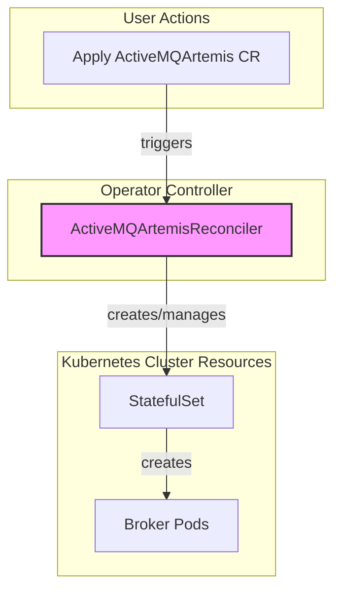
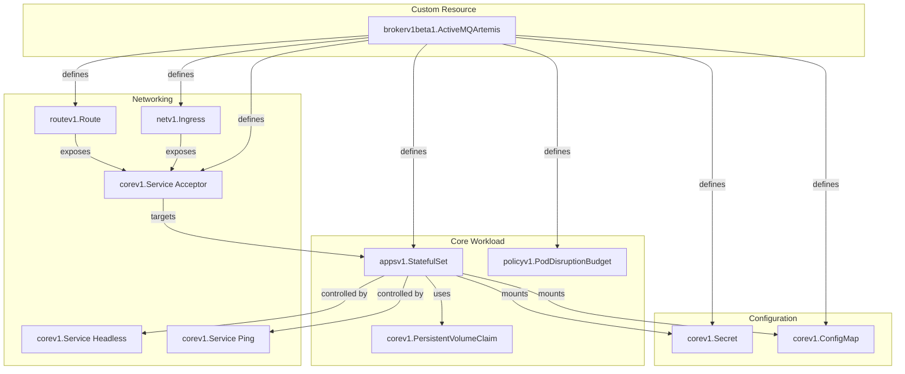
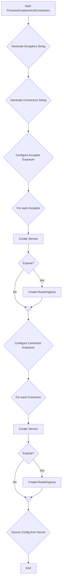
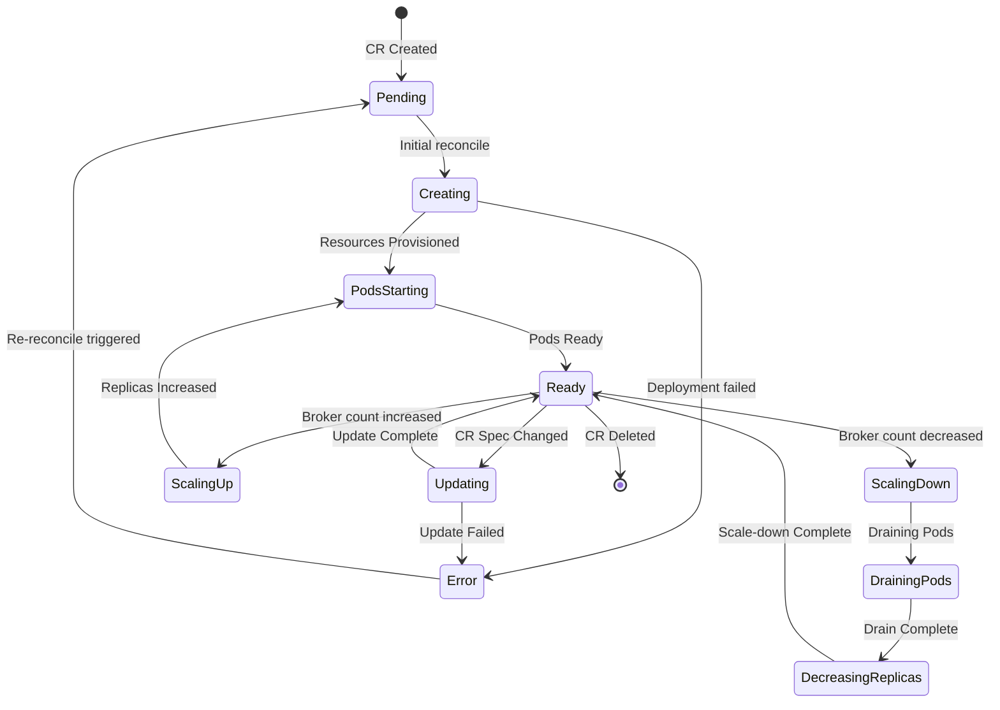

This document provides a comprehensive technical overview of the ActiveMQ Artemis Operator, intended for new developers. It covers the high-level architecture, the detailed logic of the main controller, its event-driven nature, and how it interacts with the cluster.

**Table of Contents**

1.  [High-Level Architecture](#1-high-level-architecture)
    *   [Reconciler Interaction](#reconciler-interaction)
2.  [Reconciler Logic and Flow](#2-reconciler-logic-and-flow)
    *   [Main Reconciliation Flow](#main-reconciliation-flow)
    *   [Managed Resources](#managed-resources)
    *   [Acceptor and Connector Configuration](#acceptor-and-connector-configuration)
3.  [Reconciler State Machine](#3-reconciler-state-machine)
4.  [Deprecated Custom Resources](#4-deprecated-custom-resources)
5.  [Configuring Broker Properties](#5-configuring-broker-properties)
    *   [How it Works](#how-it-works)
    *   [Basic Configuration](#basic-configuration)
    *   [Advanced Configuration](#advanced-configuration)
    *   [Practical Examples from Tests](#practical-examples-from-tests)
6.  [Restricted (Locked-Down) Mode](#6-restricted-locked-down-mode)
    *   [Overview](#overview)
    *   [Configuration Example](#configuration-example)
7.  [Key Deployment Plan Settings](#7-key-deployment-plan-settings)
    *   [Persistence and Storage](#persistence-and-storage)
    *   [Resource Management](#resource-management)
    *   [Scheduling and Affinity](#scheduling-and-affinity)
    *   [Applying Custom Patches with Resource Templates](#applying-custom-patches-with-resource-templates)
8.  [Metrics and Monitoring with Prometheus](#8-metrics-and-monitoring-with-prometheus)
    *   [Enabling Metrics](#enabling-metrics)
    *   [Deployment Modes](#deployment-modes)
    *   [Scraping with Prometheus Operator](#scraping-with-prometheus-operator)
9.  [Broker Properties Reference](#9-broker-properties-reference)
    *   [Global Broker Settings](#global-broker-settings)
    *   [Address and Queue Settings](#address-and-queue-settings)
    *   [Security and RBAC](#security-and-rbac)
    *   [Acceptor Configuration](#acceptor-configuration)

## 1. High-Level Architecture

The operator is composed of a core controller that works to manage ActiveMQ Artemis clusters. The `ActiveMQArtemisReconciler` is the core component, responsible for the main broker deployment.

### Reconciler Interaction

The diagram below shows the primary relationship between user actions and the controller.



## 2. Reconciler Logic and Flow

The controller has a reconciliation loop that is triggered by changes to the `ActiveMQArtemis` Custom Resource. The following diagrams illustrate the internal logic of the loop.

### Main Reconciliation Flow

The `Process` function is the main entry point for the reconciliation loop. It orchestrates a series of steps to converge the actual state of the cluster with the desired state defined in the CR. The high-level flow is as follows:

*   **Observe**: The reconciler first observes the current state of the cluster by retrieving all deployed resources it manages (e.g., `StatefulSet`, `Services`, `Secrets`).
*   **Process CR**: It then processes the `ActiveMQArtemis` CR to determine the desired state, including:
    *   The `StatefulSet` definition (`ProcessStatefulSet`).
    *   The deployment plan (image, size, etc.) (`ProcessDeploymentPlan`).
    *   Credentials (`ProcessCredentials`).
    *   Network acceptors and connectors (`ProcessAcceptorsAndConnectors`).
    *   The web console configuration (`ProcessConsole`).
*   **Track Changes**: The desired state is tracked, and any changes (e.g., to secrets) are noted to trigger rolling updates if necessary.
*   **Apply**: Finally, the reconciler applies the changes to the cluster by creating, updating, or deleting resources to match the desired state (`ProcessResources`).

### Managed Resources

The reconciler creates and manages a variety of Kubernetes resources to build the cluster.



### Acceptor and Connector Configuration

This process translates CR configurations into Kubernetes networking resources.



## 3. Reconciler State Machine

The controller functions as a state machine driven by cluster events. The following diagram illustrates the states and transitions for the `ActiveMQArtemisReconciler`.



## 4. Deprecated Custom Resources

The operator is moving towards a model where all broker configuration is done via `brokerProperties` on the main `ActiveMQArtemis` CR. As a result, the following custom resources are considered deprecated and should not be used for new deployments:

*   **`ActiveMQArtemisAddress`**: Address and queue configuration should now be done using the `addressConfigurations` properties. See the [Broker Properties Reference](#address-and-queue-settings) for examples.
*   **`ActiveMQArtemisSecurity`**: Security domains and permissions should now be configured using the `securityRoles` properties. See the [Security and RBAC](#security-and-rbac) reference for examples.
*   **`ActiveMQArtemisScaledown`**: Message draining and migration on scale-down is now controlled by the `spec.deploymentPlan.messageMigration` flag on the `ActiveMQArtemis` CR.

While the controllers for these CRs still exist to support legacy deployments, they will be removed in a future release.

## 5. Configuring Broker Properties

> **Note:**
> Configuring the broker via `brokerProperties` is the recommended and most flexible approach. It allows direct access to the broker's internal configuration bean and should be preferred over legacy mechanisms like `addressSettings` or the deprecated CRs.

The operator provides a powerful mechanism to directly configure the internal settings of the ActiveMQ Artemis broker through the `brokerProperties` field on the `ActiveMQArtemis` custom resource. This allows you to fine-tune the broker's behavior, override defaults, and configure features that are not explicitly exposed as attributes in the CRD.

For a complete list of available properties, refer to the official [ActiveMQ Artemis configuration documentation](https://activemq.apache.org/components/artemis/documentation/latest/configuration-index.html#broker-properties).

### How it Works

The operator takes the `brokerProperties` provided in the CR, processes them, and stores them in a Kubernetes `Secret`. This secret is then mounted as a file into the broker pods at `/amq/extra/props`. The broker is configured to load these properties on startup via a Java system property (`-Dbroker.properties=...`) that points to the mounted file.

### Basic Configuration

The `brokerProperties` field is an array of strings, where each string is a `key=value` pair.

```yaml
apiVersion: broker.amq.io/v1beta1
kind: ActiveMQArtemis
metadata:
  name: ex-aao
spec:
  # ... other spec fields ...
  brokerProperties:
    - "globalMaxSize=512m"
    - "address-memory-usage-full-policy=FAIL"
```

#### Escaping Special Characters

The properties are stored in a standard Java properties file format. If your keys or values need to include special characters like spaces (` `), colons (`:`), or equals signs (`=`), you must escape them with a backslash (`\`).

### Advanced Configuration

#### Ordinal-Specific Properties

For advanced use cases, you can provide configuration that targets a specific broker pod in the `StatefulSet`. This is done by prefixing the property key with `broker-N.`, where `N` is the ordinal of the broker pod (starting from 0).

When the operator detects this prefix, it creates separate property files for each targeted ordinal within the secret, ensuring each broker gets its specific configuration.

```yaml
spec:
  brokerProperties:
    # This applies to all brokers
    - "globalMaxSize=512m"
    # This applies ONLY to the broker pod with ordinal 0 (e.g., ex-aao-ss-0)
    - "broker-0.management-address=prod.management.0"
    # This applies ONLY to the broker pod with ordinal 1 (e.g., ex-aao-ss-1)
    - "broker-1.management-address=prod.management.1"
```

#### Providing Properties from an External Secret

To better organize your properties or to source them from a different management system, you can provide them in a separate Kubernetes `Secret` and mount it into the broker.

If a secret mounted via `extraMounts` has a name ending with the suffix `-bp` (for **b**roker **p**roperties), the operator will automatically treat it as a source of broker properties and include it in the broker's configuration path.

Properties are applied in order: first the properties from the CR's `brokerProperties` field, then the properties from each `-bp` secret, loaded in alphabetical order by secret name.

**1. Create a secret with a `-bp` suffix:**

The secret can contain multiple keys, where each key represents a file. The content of each file should be in Java properties format.

```yaml
apiVersion: v1
kind: Secret
metadata:
  name: my-extra-config-bp
stringData:
  global-mem.properties: |
    globalMaxSize=1G
  tuning.properties: |
    journal-buffer-timeout=10000
```

**2. Reference the secret in the `ActiveMQArtemis` CR:**

```yaml
apiVersion: broker.amq.io/v1beta1
kind: ActiveMQArtemis
metadata:
  name: ex-aao
spec:
  deploymentPlan:
    extraMounts:
      secrets:
        - "my-extra-config-bp"
  # You can still have properties here, they will be applied first
  brokerProperties:
    - "journal-sync-transactional=true"
```

### Practical Examples from Tests

The following examples are drawn from the operator's test suite and demonstrate common configuration scenarios.

#### Example 1: Basic Global Configuration

This is the simplest case, where properties are applied to all broker pods in the cluster. This example sets the maximum disk usage and the minimum free disk space required.

```yaml
apiVersion: broker.amq.io/v1beta1
kind: ActiveMQArtemis
metadata:
  name: ex-aao
spec:
  brokerProperties:
    - "maxDiskUsage=97"
    - "minDiskFree=5"
```

#### Example 2: Ordinal-Specific Configuration

You can apply different settings to individual broker pods using an ordinal prefix (`broker-N.`). This is useful for configurations that must be unique to each broker, such as management addresses.

In this example, `broker-0` and `broker-999` are assigned different disk usage limits.

```yaml
apiVersion: broker.amq.io/v1beta1
kind: ActiveMQArtemis
metadata:
  name: ex-aao
spec:
  brokerProperties:
    - "broker-0.maxDiskUsage=98"
    - "broker-0.minDiskFree=6"
    - "broker-999.maxDiskUsage=99"
    - "broker-999.minDiskFree=7"
```

#### Example 3: Mixed Global and Ordinal Configuration

You can combine global and ordinal-specific properties. The global properties will apply to all brokers, while the ordinal-specific properties will override the global settings for that particular broker.

```yaml
apiVersion: broker.amq.io/v1beta1
kind: ActiveMQArtemis
metadata:
  name: ex-aao
spec:
  brokerProperties:
    # Global settings for all brokers
    - "globalMaxSize=256m"
    - "minDiskFree=5"
    # Override for broker-0
    - "broker-0.globalMaxSize=512m"
    - "broker-0.minDiskFree=10"
```

#### Example 4: Configuring Addresses and Queues

The `addressConfigurations` and `securityRoles` properties can be used to declaratively define addresses, queues, and their associated permissions. This is a powerful alternative to using the `ActiveMQArtemisAddress` custom resource.

Note the use of `\\:\\:` to escape the `::` separator for a fully qualified queue name (FQQN).

```yaml
apiVersion: broker.amq.io/v1beta1
kind: ActiveMQArtemis
metadata:
  name: ex-aao
spec:
  brokerProperties:
    # Create an anycast address and queue
    - "addressConfigurations.TOMS_WORK_QUEUE.routingTypes=ANYCAST"
    - "addressConfigurations.TOMS_WORK_QUEUE.queueConfigs.TOMS_WORK_QUEUE.routingType=ANYCAST"
    - "addressConfigurations.TOMS_WORK_QUEUE.queueConfigs.TOMS_WORK_QUEUE.durable=true"

    # Create a multicast address and an associated durable queue (FQQN)
    - "addressConfigurations.TOPIC.routingTypes=MULTICAST"
    - "addressConfigurations.TOPIC.queueConfigs.FOR_TOM.routingType=MULTICAST"
    - "addressConfigurations.TOPIC.queueConfigs.FOR_TOM.address=TOPIC"
    - "addressConfigurations.TOPIC.queueConfigs.FOR_TOM.durable=true"

    # Grant the 'toms' role 'send' permission to the anycast queue
    - "securityRoles.TOMS_WORK_QUEUE.toms.send=true"
    
    # Grant the 'toms' role 'send' permission to the FQQN
    - "securityRoles.\"TOPIC\\:\\:FOR_TOM\".toms.send=true"
```

#### Example 5: Configuring Address Settings (Dead Lettering, etc.)

The `addressSettings` property allows you to apply detailed configurations to groups of addresses using wildcards. This example configures default dead-letter and expiry policies for all addresses (`#`), and then overrides them for a specific address.

```yaml
apiVersion: broker.amq.io/v1beta1
kind: ActiveMQArtemis
metadata:
  name: ex-aao
spec:
  brokerProperties:
    # Default settings for all addresses
    - "addressSettings.#.enableMetrics=true"
    - "addressSettings.#.autoCreateExpiryResources=false"
    - "addressSettings.#.deadLetterAddress=DLQ"
    - "addressSettings.#.autoCreateDeadLetterResources=true"
    - "addressSettings.#.deadLetterQueuePrefix=DLQ"
    - "addressSettings.#.maxDeliveryAttempts=10"

    # Override settings for addresses matching 'XxxxxxXXxxXdata#'
    - "addressSettings.XxxxxxXXxxXdata#.deadLetterAddress=DLQ.XxxxxxXXxxXdata"
    - "addressSettings.XxxxxxXXxxXdata#.autoCreateExpiryResources=true"
```

#### Example 6: Fine-Tuning Acceptors

You can fine-tune acceptor settings by using the `acceptorConfigurations` property. This is useful for setting protocol-specific options that aren't directly exposed in the CRD's `acceptors` section.

**Note:** The broker pods must be restarted to apply changes to acceptor properties.

```yaml
apiVersion: broker.amq.io/v1beta1
kind: ActiveMQArtemis
metadata:
  name: ex-aao
spec:
  acceptors:
    - name: artemis
      port: 61616
      protocols: "all"
  brokerProperties:
    - "acceptorConfigurations.artemis.extraParams.defaultMqttSessionExpiryInterval=86400"
```

## 6. Restricted (Locked-Down) Mode

### Overview

For production and security-sensitive environments, the operator provides a "restricted" or "locked-down" mode. This mode creates a minimal, secure broker deployment by enforcing modern security best practices. It is enabled by setting `spec.restricted: true` in the `ActiveMQArtemis` custom resource.

Key characteristics of restricted mode include:

*   **No Init-Container**: The broker runs as a single container, reducing its attack surface.
*   **No Web Console**: The Jetty-based web console is disabled. All management is done via the Jolokia agent.
*   **No XML Configuration**: The broker is configured entirely through `brokerProperties`, eliminating XML parsing.
*   **Mutual TLS (mTLS)**: All communication with the broker, including management via Jolokia, is secured with mTLS. This requires `cert-manager` to be installed in the cluster to issue the necessary certificates.
*   **Strict RBAC**: A strict Role-Based Access Control policy is enforced on the Jolokia endpoint, limiting management access to only the operator's service account by default.

This mode is the recommended approach for new deployments.

### Configuration Example

The following example, based on the operator's test suite, shows how to deploy a minimal broker in restricted mode. This example assumes `cert-manager` is installed and configured with a `ClusterIssuer`.

```yaml
apiVersion: broker.amq.io/v1beta1
kind: ActiveMQArtemis
metadata:
  name: artemis-restricted
  namespace: my-namespace
spec:
  # Enable restricted mode
  restricted: true
  
  deploymentPlan:
    size: 1
    image: placeholder # Add your broker image here
  
  # Example broker property
  brokerProperties:
    - "messageCounterSamplePeriod=500"
    
  # The operator will automatically configure the necessary mTLS certs.
  # This example assumes default cert names and a cert-manager issuer.
  # You would typically have cert-manager create these secrets for you.
```

## 7. Key Deployment Plan Settings

The `spec.deploymentPlan` object in the `ActiveMQArtemis` CR is the primary way to configure the broker's runtime environment. The following are some of the most important and commonly used settings, with examples derived from the test suite.

### Persistence and Storage

By default, brokers are ephemeral. To retain data across restarts, you must enable persistence.

*   `persistenceEnabled`: Set to `true` to enable journal persistence using Persistent Volume Claims (PVCs).
*   `storage.size`: The size of the PVC to request (e.g., `4Gi`, `100Mi`).
*   `storage.storageClassName`: The name of the `StorageClass` to use for the PVC.
*   `messageMigration`: Set to `true` to enable the draining and migration of messages from a broker pod before it is scaled down.

```yaml
spec:
  deploymentPlan:
    persistenceEnabled: true
    messageMigration: true
    storage:
      size: 2Gi
      storageClassName: standard
```

### Resource Management

You can control the CPU and memory resources allocated to the broker pods.

*   `resources`: A standard Kubernetes `ResourceRequirements` object to specify CPU/memory requests and limits.

```yaml
spec:
  deploymentPlan:
    resources:
      requests:
        cpu: "500m"
        memory: "1Gi"
      limits:
        cpu: "1"
        memory: "2Gi"
```

### Scheduling and Affinity

These settings allow you to control how broker pods are scheduled onto nodes in the cluster.

*   `nodeSelector`: A map of labels to select which nodes the broker pods can be scheduled on.
*   `tolerations`: A list of tolerations to allow pods to be scheduled on nodes with matching taints.
*   `affinity`: A standard Kubernetes `Affinity` object to define complex node and pod affinity/anti-affinity rules.

```yaml
spec:
  deploymentPlan:
    nodeSelector:
      disktype: ssd
    tolerations:
    - key: "app"
      operator: "Equal"
      value: "artemis"
      effect: "NoSchedule"
    affinity:
      podAntiAffinity:
        requiredDuringSchedulingIgnoredDuringExecution:
        - labelSelector:
            matchExpressions:
            - key: "app"
              operator: In
              values:
              - artemis
          topologyKey: "kubernetes.io/hostname"
```

### Applying Custom Patches with Resource Templates

For advanced customizations that are not directly exposed in the CRD, you can use `resourceTemplates` to apply a strategic merge patch to the resources the operator creates (like the `StatefulSet`).

This example uses a patch to add a custom annotation to the broker's `StatefulSet`.

```yaml
spec:
  resourceTemplates:
    - selector:
        kind: StatefulSet
      patch:
        metadata:
          annotations:
            "my-custom-annotation": "my-custom-value"
```

## 8. Metrics and Monitoring with Prometheus

The operator supports exposing broker metrics in a Prometheus-compatible format. This is controlled by the `enableMetricsPlugin` flag in the custom resource.

### Enabling Metrics

To enable metrics, set `spec.deploymentPlan.enableMetricsPlugin: true` in your `ActiveMQArtemis` CR:

```yaml
apiVersion: broker.amq.io/v1beta1
kind: ActiveMQArtemis
metadata:
  name: ex-aao
spec:
  deploymentPlan:
    enableMetricsPlugin: true
    # ... other deployment plan fields ...
```

### Deployment Modes

The way metrics are exposed depends on whether the broker is deployed in `restricted` mode.

#### Legacy Mode (default)

When `restricted: false` (or is omitted), enabling the metrics plugin adds the official [Artemis Prometheus Metrics Plugin](https://activemq.apache.org/components/artemis/documentation/latest/metrics.html) to the broker's classpath.

*   **Endpoint**: Metrics are exposed on the broker's web console port (default `8161`) at the `/metrics` path.
*   **Security**: The endpoint is secured by the same credentials as the web console.

#### Restricted (Locked-Down) Mode

When `restricted: true`, the operator injects the [Prometheus JMX Exporter](https://github.com/prometheus/jmx_exporter) as a Java agent into the broker pod.

*   **Endpoint**: Metrics are exposed on a dedicated port (default `8888`) at the `/` path.
*   **Security**: The endpoint is secured with mTLS, and clients must present a valid certificate. By default, only clients with a certificate CN of `activemq-artemis-operator` are authorized, but this can be customized with `brokerProperties`.

### Scraping with Prometheus Operator

If you are using the [Prometheus Operator](https://prometheus-operator.dev/), you can configure scraping by creating a `ServiceMonitor` resource.

The following example will configure Prometheus to scrape metrics from a broker named `artemis-restricted` deployed in `restricted` mode. Note the `tlsConfig` section, which is required for mTLS.

```yaml
apiVersion: monitoring.coreos.com/v1
kind: ServiceMonitor
metadata:
  name: artemis-restricted-monitor
  labels:
    # Your Prometheus Operator instance must be configured to select this label
    release: prometheus
spec:
  selector:
    matchLabels:
      # This must match the labels on the broker's headless service
      ActiveMQArtemis: artemis-restricted
  endpoints:
  - port: metrics # This is the name of the port on the headless service
    scheme: https
    path: /
    interval: 10s
    tlsConfig:
      # Secret containing the CA that signed the broker's cert
      ca:
        secret:
          name: activemq-artemis-manager-ca
          key: ca.pem
      # Secret containing the client cert for Prometheus
      cert:
        secret:
          name: activemq-artemis-manager-cert
          key: tls.crt
      # Secret containing the client key for Prometheus
      keySecret:
        name: activemq-artemis-manager-cert
        key: tls.key
      # This must match one of the dnsNames in the broker's server cert
      serverName: artemis-restricted-ss-0.artemis-restricted-hdls-svc.my-namespace.svc.cluster.local
```

## 9. Broker Properties Reference

> **Note:**
> This section provides a list of tested and verified broker properties with practical examples. For a complete and exhaustive list of all available properties, please refer to the official [ActiveMQ Artemis Broker Properties Reference](https://activemq.apache.org/components/artemis/documentation/latest/configuration-index.html#broker-properties).

### Global Broker Settings

These properties affect the overall behavior and resource usage of the broker.

| Property      | Description                                                 | Example                                     |
|---------------|-------------------------------------------------------------|---------------------------------------------|
| `globalMaxSize` | The maximum amount of memory messages can consume in a broker. | `brokerProperties: ["globalMaxSize=1G"]`      |
| `maxDiskUsage`  | The percentage of disk usage at which the broker will block.  | `brokerProperties: ["maxDiskUsage=95"]`       |
| `minDiskFree`   | The minimum amount of free disk space required.             | `brokerProperties: ["minDiskFree=5"]`         |

### Address and Queue Settings

These properties allow for the declarative configuration of addresses, queues, and their behaviors.

| Property                                                      | Description                                                                    | Example                                                                                                                                                                                                                                                                                                |
|---------------------------------------------------------------|--------------------------------------------------------------------------------|----------------------------------------------------------------------------------------------------------------------------------------------------------------------------------------------------------------------------------------------------------------------------------------------------|
| `addressConfigurations.<addr-name>.routingTypes`                | Defines the routing type for an address (e.g., `ANYCAST`, `MULTICAST`).           | `brokerProperties: ["addressConfigurations.myAddress.routingTypes=ANYCAST"]`                                                                                                                                                                                                                     |
| `addressConfigurations.<addr-name>.queueConfigs.<q-name>.address` | Associates a queue with a specific address.                                    | `brokerProperties: ["addressConfigurations.myAddress.queueConfigs.myQueue.address=myAddress"]`                                                                                                                                                                                                 |
| `addressConfigurations.<addr-name>.queueConfigs.<q-name>.routingType` | Defines the routing type for a queue.                                          | `brokerProperties: ["addressConfigurations.myAddress.queueConfigs.myQueue.routingType=ANYCAST"]`                                                                                                                                                                                                 |
| `addressSettings.<addr-match>.deadLetterAddress`                | Sets the dead-letter address for messages sent to a matching address.          | `brokerProperties: ["addressSettings.#.deadLetterAddress=DLQ"]`                                                                                                                                                                                                                                  |
| `addressSettings.<addr-match>.autoCreateDeadLetterResources`    | If `true`, automatically creates the dead-letter address and queue.              | `brokerProperties: ["addressSettings.#.autoCreateDeadLetterResources=true"]`                                                                                                                                                                                                                     |
| `addressSettings.<addr-match>.maxDeliveryAttempts`              | The number of times to attempt message delivery before sending to the DLA.     | `brokerProperties: ["addressSettings.#.maxDeliveryAttempts=10"]`                                                                                                                                                                                                                                 |
| `addressSettings.<addr-match>.configDeleteQueues`               | `FORCE` will delete queues that are no longer in the configuration upon reload.    | `brokerProperties: ["addressSettings.myAddress.configDeleteQueues=FORCE"]`                                                                                                                                                                                                                       |

### Security and RBAC

These properties are used to configure authorization roles for addresses and management operations.

| Property                                      | Description                                                                | Example                                                                                                                                                                                             |
|-----------------------------------------------|----------------------------------------------------------------------------|-----------------------------------------------------------------------------------------------------------------------------------------------------------------------------------------------------|
| `securityRoles.<addr-name>.<role>.<perm>`       | Grants a permission (`send`, `consume`, etc.) to a role for a specific address. | `brokerProperties: ["securityRoles.myQueue.myRole.send=true"]`                                                                                                                                        |
| `securityRoles."<fqqn>".<role>.<perm>`         | Grants permission to a role for a Fully Qualified Queue Name (FQQN).       | `brokerProperties: ["securityRoles.\"myTopic\\:\\:myQueue\".myRole.consume=true"]`                                                                                                                   |
| `securityRoles."mops.<path>".<role>.<perm>`    | Grants management permissions (`view`, `edit`) to a role for a JMX object. | `brokerProperties: ["securityRoles.\"mops.address.myQueue.*\".myRole.view=true"]`                                                                                                                |
| `securityRoles."mops.<operation>".denied`     | Explicitly denies a management operation to all roles.                     | `brokerProperties: ["securityRoles.\"mops.broker.forceFailover\".denied=-"]`                                                                                                                        |

### Acceptor Configuration

These properties allow for fine-tuning of protocol-specific acceptor settings.

| Property                                                           | Description                                                        | Example                                                                                                                                                                                             |
|--------------------------------------------------------------------|--------------------------------------------------------------------|-----------------------------------------------------------------------------------------------------------------------------------------------------------------------------------------------------|
| `acceptorConfigurations.<acc-name>.factoryClassName`               | The Java class name for the acceptor factory.                        | `brokerProperties: ["acceptorConfigurations.amqp.factoryClassName=org.apache.activemq.artemis.core.remoting.impl.netty.NettyAcceptorFactory"]`                                                    |
| `acceptorConfigurations.<acc-name>.params.<key>`                   | A key-value parameter for the acceptor.                              | `brokerProperties: ["acceptorConfigurations.amqp.params.port=61617"]`                                                                                                                               |
| `acceptorConfigurations.<acc-name>.extraParams.<key>`              | An extra, protocol-specific parameter for the acceptor.              | `brokerProperties: ["acceptorConfigurations.artemis.extraParams.defaultMqttSessionExpiryInterval=86400"]`                                                                                         |
