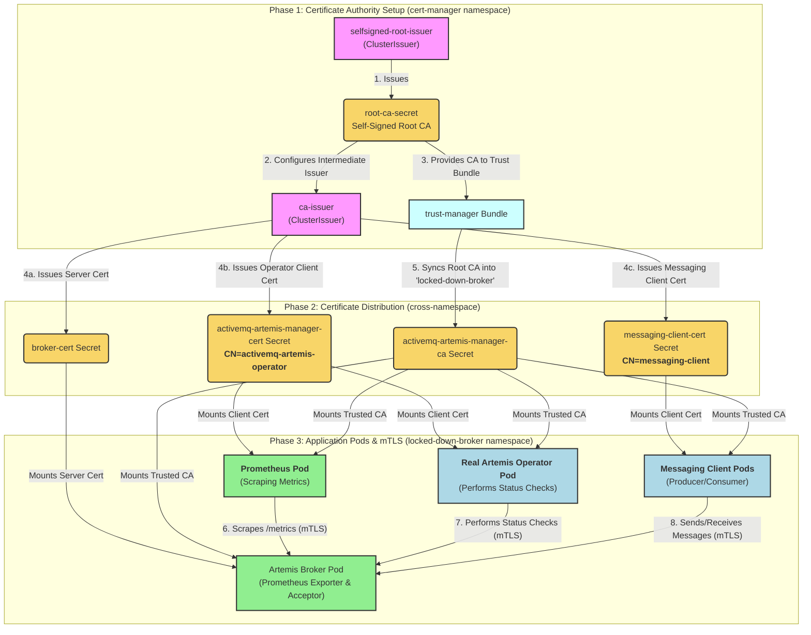
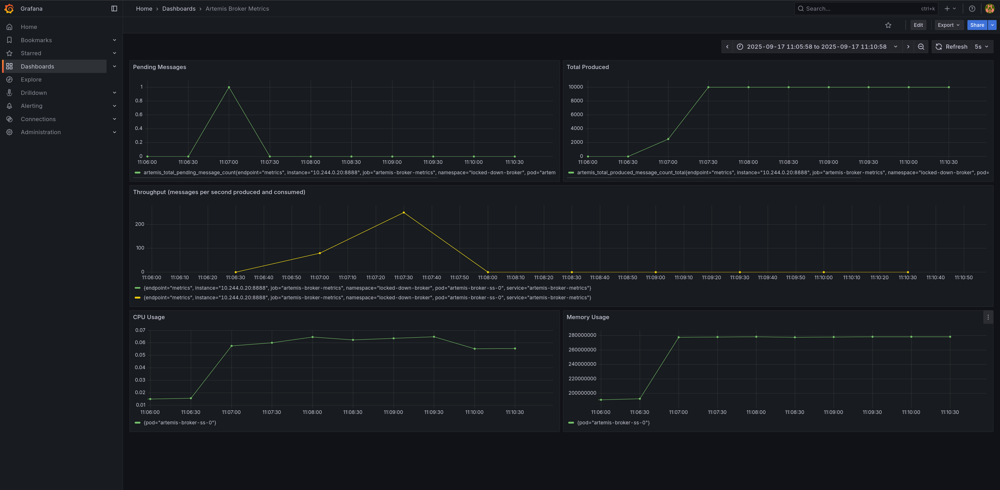

This tutorial shows how to deploy a "locked-down" ActiveMQ Artemis broker and
securely access its Prometheus metrics endpoint from within the same Kubernetes
cluster using mutual TLS (mTLS).

We will cover the following steps:
1. **Set Up Monitoring Infrastructure:** Install the Prometheus and Grafana
   Operators to manage our monitoring stack.
2. **Set Up Certificate Infrastructure:** Install `cert-manager` and
   `trust-manager` to create a local Certificate Authority (CA) and issue the
   necessary TLS certificates.
3. **Deploy the Locked-Down Broker:** Deploy an `ActiveMQArtemis` custom
   resource with security restrictions enabled (`spec.restricted: true`).
4. **Configure Prometheus:** Create a `ServiceMonitor` to securely scrape the
   broker's metrics endpoint using mTLS.
5. **Deploy Grafana:** Set up Grafana with a pre-configured dashboard to
   visualize the metrics collected by Prometheus.
6. **Generate and Observe Metrics:** Run messaging client jobs to produce and
    consume messages, and then observe the resulting metrics in the Grafana
    dashboard.

A locked-down broker (`spec.restricted=true`) enhances security by disabling
anonymous access, enabling client certificate authentication, and relying on
`cert-manager` for certificate lifecycle management.

## Table of Contents

* [Certificate Flow Diagram](#certificate-flow-diagram)
* [Understanding the Naming Conventions](#understanding-the-naming-conventions)
* [Prerequisites](#prerequisites)
* [Deploy the Operator](#deploy-the-operator)
* [Set Up Certificate Infrastructure with Cert-Manager](#set-up-certificate-infrastructure-with-cert-manager)
* [Deploy the Locked-Down Broker](#deploy-the-locked-down-broker)
* [Configure and Deploy Prometheus](#configure-and-deploy-prometheus)
* [Deploy and Configure Grafana](#deploy-and-configure-grafana)
* [Verify in Grafana UI](#verify-in-grafana-ui)
* [Exchange Messages](#exchange-messages)
* [Cleanup](#cleanup)
* [Conclusion](#conclusion)

## Certificate Flow Diagram

This diagram illustrates how certificates are issued and distributed, and how the
different components in this tutorial interact with each other.



## Understanding the Naming Conventions

The locked-down broker security model relies on several specific naming
conventions. Understanding these is key to adapting this tutorial to your own
environment.

* **Operator Role:** The broker grants privileged access (the
  `operator` role) to any client that presents a certificate with the **Common
  Name (CN)** `activemq-artemis-operator`. This is the most critical convention.
  In this tutorial, the `activemq-artemis-manager-cert` is issued with this CN,
  which is why the `Prometheus` pod can access the metrics. The real operator
  uses a certificate with the same CN to perform its management tasks.

* **Broker Certificate:** The operator expects the broker's
  server certificate to be in a secret named `broker-cert`. This is defined
  in the code as `DefaultOperandCertSecretName`. While the operator can also
  find secrets with the prefix `<CR_NAME>-broker-cert`, using the default
  `broker-cert` is the standard practice shown in this tutorial.

* **Broker DNS Names:** The server certificate (`broker-cert`) must
  have a `dnsNames` entry that matches the broker pod's internal Fully Qualified
  Domain Name (FQDN). Kubernetes services follow a predictable pattern:
  `<statefulset-name>-<ordinal>.<headless-service-name>.<namespace>.svc.cluster.local`.
  The tutorial constructs this FQDN and includes it in the certificate request.

* **Trust Bundle Key:** The operator configures the broker pod to look for a
  CA trust bundle with a specific key name. The secret created by the
  `trust-manager` `Bundle` **must** contain the CA certificate under the key
  `ca.pem`. The Prometheus scrape configuration in this tutorial is set up to
  reflect this, but it's important to know that the broker itself has this
  requirement.

> [NOTE]
>
> For simplicity, this tutorial uses the operator's identity to access
> metrics.

## Prerequisites

Before you start, you need to have access to a running Kubernetes cluster
environment. A [Minikube](https://minikube.sigs.k8s.io/docs/start/) instance
running on your laptop will do fine.

### Start minikube

```{"stage":"init", "id":"minikube_start"}
minikube start --profile tutorialtester
minikube profile tutorialtester
kubectl config use-context tutorialtester
minikube addons enable metrics-server --profile tutorialtester
```
```shell markdown_runner
* [tutorialtester] minikube v1.36.0 on Fedora 41
* Automatically selected the kvm2 driver. Other choices: qemu2, ssh
* Starting "tutorialtester" primary control-plane node in "tutorialtester" cluster
* Creating kvm2 VM (CPUs=2, Memory=6000MB, Disk=20000MB) ...
* Preparing Kubernetes v1.33.1 on Docker 28.0.4 ...
  - Generating certificates and keys ...
  - Booting up control plane ...
  - Configuring RBAC rules ...
* Configuring bridge CNI (Container Networking Interface) ...
* Verifying Kubernetes components...
  - Using image gcr.io/k8s-minikube/storage-provisioner:v5
* Enabled addons: default-storageclass, storage-provisioner
* Done! kubectl is now configured to use "tutorialtester" cluster and "default" namespace by default
! Image was not built for the current minikube version. To resolve this you can delete and recreate your minikube cluster using the latest images. Expected minikube version: v1.35.0 -> Actual minikube version: v1.36.0
* minikube profile was successfully set to tutorialtester
Switched to context "tutorialtester".
* metrics-server is an addon maintained by Kubernetes. For any concerns contact minikube on GitHub.
You can view the list of minikube maintainers at: https://github.com/kubernetes/minikube/blob/master/OWNERS
  - Using image registry.k8s.io/metrics-server/metrics-server:v0.7.2
* The 'metrics-server' addon is enabled
```

### Enable nginx ingress for minikube

We need to enable ssl passthrough for the ingress controller to allow the broker
to handle TLS termination.

```{"stage":"init"}
minikube addons enable ingress
minikube kubectl -- patch deployment -n ingress-nginx ingress-nginx-controller --type='json' -p='[{"op": "add", "path": "/spec/template/spec/containers/0/args/-", "value":"--enable-ssl-passthrough"}]'
```
```shell markdown_runner
* ingress is an addon maintained by Kubernetes. For any concerns contact minikube on GitHub.
You can view the list of minikube maintainers at: https://github.com/kubernetes/minikube/blob/master/OWNERS
  - Using image registry.k8s.io/ingress-nginx/kube-webhook-certgen:v1.5.3
  - Using image registry.k8s.io/ingress-nginx/controller:v1.12.2
  - Using image registry.k8s.io/ingress-nginx/kube-webhook-certgen:v1.5.3
* Verifying ingress addon...
* The 'ingress' addon is enabled
deployment.apps/ingress-nginx-controller patched
```

### Get minikube's IP

This will be used later to construct the Ingress hostname.

```{"stage":"init", "runtime":"bash", "label":"get the cluster ip"}
export CLUSTER_IP=$(minikube ip --profile tutorialtester)
```

### Create the namespace

All resources for this tutorial will be created in the `locked-down-broker` namespace.

```{"stage":"init", "runtime":"bash", "label":"create the namespace"}
kubectl create namespace locked-down-broker
kubectl config set-context --current --namespace=locked-down-broker
until kubectl get serviceaccount default -n locked-down-broker &> /dev/null; do sleep 1; done
```
```shell markdown_runner
namespace/locked-down-broker created
Context "tutorialtester" modified.
```

### Deploy the Operator

Go to the root of the operator repo and install it into the `locked-down-broker` namespace.

```{"stage":"init", "rootdir":"$initial_dir"}
./deploy/install_opr.sh
```
```shell markdown_runner
Deploying operator to watch single namespace
Client Version: 4.18.5
Kustomize Version: v5.4.2
Kubernetes Version: v1.33.1
customresourcedefinition.apiextensions.k8s.io/activemqartemises.broker.amq.io created
customresourcedefinition.apiextensions.k8s.io/activemqartemisaddresses.broker.amq.io created
customresourcedefinition.apiextensions.k8s.io/activemqartemisscaledowns.broker.amq.io created
customresourcedefinition.apiextensions.k8s.io/activemqartemissecurities.broker.amq.io created
serviceaccount/activemq-artemis-controller-manager created
role.rbac.authorization.k8s.io/activemq-artemis-operator-role created
rolebinding.rbac.authorization.k8s.io/activemq-artemis-operator-rolebinding created
role.rbac.authorization.k8s.io/activemq-artemis-leader-election-role created
rolebinding.rbac.authorization.k8s.io/activemq-artemis-leader-election-rolebinding created
deployment.apps/activemq-artemis-controller-manager created
```

Wait for the Operator to start (status: `running`).

```{"stage":"init", "label":"wait for the operator to be running"}
kubectl wait pod --all --for=condition=Ready --namespace=locked-down-broker --timeout=600s
```
```shell markdown_runner
pod/activemq-artemis-controller-manager-6f4f5f699f-c6s89 condition met
```

### Install the dependencies

#### Install Prometheus Operator

Before setting up the certificate infrastructure, let's install the Prometheus Operator.
It will simplify the deployment and management of Prometheus.

```{"stage":"init", "runtime":"bash", "label":"install the prometheus operator"}
helm repo add prometheus-community https://prometheus-community.github.io/helm-charts
helm upgrade -i prometheus prometheus-community/kube-prometheus-stack \
  -n locked-down-broker \
  --set grafana.sidecar.dashboards.namespace=ALL \
  --set grafana.sidecar.dashboards.enabled=true \
  --set kubeEtcd.enabled=false \
  --set kubeControllerManager.enabled=false \
  --set kubeScheduler.enabled=false \
  --set prometheus.prometheusSpec.kubelet.insecureSkipVerify=true \
  --set prometheus.prometheusSpec.metricsServer.insecureSkipVerify=true \
  --wait
```
```shell markdown_runner
"prometheus-community" already exists with the same configuration, skipping
Release "prometheus" does not exist. Installing it now.
NAME: prometheus
LAST DEPLOYED: Wed Sep 17 11:24:09 2025
NAMESPACE: locked-down-broker
STATUS: deployed
REVISION: 1
NOTES:
kube-prometheus-stack has been installed. Check its status by running:
  kubectl --namespace locked-down-broker get pods -l "release=prometheus"

Get Grafana 'admin' user password by running:

  kubectl --namespace locked-down-broker get secrets prometheus-grafana -o jsonpath="{.data.admin-password}" | base64 -d ; echo

Access Grafana local instance:

  export POD_NAME=$(kubectl --namespace locked-down-broker get pod -l "app.kubernetes.io/name=grafana,app.kubernetes.io/instance=prometheus" -oname)
  kubectl --namespace locked-down-broker port-forward $POD_NAME 3000

Visit https://github.com/prometheus-operator/kube-prometheus for instructions on how to create & configure Alertmanager and Prometheus instances using the Operator.
```

#### Install Cert-Manager

```{"stage":"certs"}
kubectl apply -f https://github.com/cert-manager/cert-manager/releases/download/v1.13.2/cert-manager.yaml
```
```shell markdown_runner
namespace/cert-manager created
customresourcedefinition.apiextensions.k8s.io/certificaterequests.cert-manager.io created
customresourcedefinition.apiextensions.k8s.io/certificates.cert-manager.io created
customresourcedefinition.apiextensions.k8s.io/challenges.acme.cert-manager.io created
customresourcedefinition.apiextensions.k8s.io/clusterissuers.cert-manager.io created
customresourcedefinition.apiextensions.k8s.io/issuers.cert-manager.io created
customresourcedefinition.apiextensions.k8s.io/orders.acme.cert-manager.io created
serviceaccount/cert-manager-cainjector created
serviceaccount/cert-manager created
serviceaccount/cert-manager-webhook created
configmap/cert-manager created
configmap/cert-manager-webhook created
clusterrole.rbac.authorization.k8s.io/cert-manager-cainjector created
clusterrole.rbac.authorization.k8s.io/cert-manager-controller-issuers created
clusterrole.rbac.authorization.k8s.io/cert-manager-controller-clusterissuers created
clusterrole.rbac.authorization.k8s.io/cert-manager-controller-certificates created
clusterrole.rbac.authorization.k8s.io/cert-manager-controller-orders created
clusterrole.rbac.authorization.k8s.io/cert-manager-controller-challenges created
clusterrole.rbac.authorization.k8s.io/cert-manager-controller-ingress-shim created
clusterrole.rbac.authorization.k8s.io/cert-manager-cluster-view created
clusterrole.rbac.authorization.k8s.io/cert-manager-view created
clusterrole.rbac.authorization.k8s.io/cert-manager-edit created
clusterrole.rbac.authorization.k8s.io/cert-manager-controller-approve:cert-manager-io created
clusterrole.rbac.authorization.k8s.io/cert-manager-controller-certificatesigningrequests created
clusterrole.rbac.authorization.k8s.io/cert-manager-webhook:subjectaccessreviews created
clusterrolebinding.rbac.authorization.k8s.io/cert-manager-cainjector created
clusterrolebinding.rbac.authorization.k8s.io/cert-manager-controller-issuers created
clusterrolebinding.rbac.authorization.k8s.io/cert-manager-controller-clusterissuers created
clusterrolebinding.rbac.authorization.k8s.io/cert-manager-controller-certificates created
clusterrolebinding.rbac.authorization.k8s.io/cert-manager-controller-orders created
clusterrolebinding.rbac.authorization.k8s.io/cert-manager-controller-challenges created
clusterrolebinding.rbac.authorization.k8s.io/cert-manager-controller-ingress-shim created
clusterrolebinding.rbac.authorization.k8s.io/cert-manager-controller-approve:cert-manager-io created
clusterrolebinding.rbac.authorization.k8s.io/cert-manager-controller-certificatesigningrequests created
clusterrolebinding.rbac.authorization.k8s.io/cert-manager-webhook:subjectaccessreviews created
role.rbac.authorization.k8s.io/cert-manager-cainjector:leaderelection created
role.rbac.authorization.k8s.io/cert-manager:leaderelection created
role.rbac.authorization.k8s.io/cert-manager-webhook:dynamic-serving created
rolebinding.rbac.authorization.k8s.io/cert-manager-cainjector:leaderelection created
rolebinding.rbac.authorization.k8s.io/cert-manager:leaderelection created
rolebinding.rbac.authorization.k8s.io/cert-manager-webhook:dynamic-serving created
service/cert-manager created
service/cert-manager-webhook created
deployment.apps/cert-manager-cainjector created
deployment.apps/cert-manager created
deployment.apps/cert-manager-webhook created
mutatingwebhookconfiguration.admissionregistration.k8s.io/cert-manager-webhook created
validatingwebhookconfiguration.admissionregistration.k8s.io/cert-manager-webhook created
```

Wait for `cert-manager` to be ready.

```{"stage":"certs", "label":"wait for cert-manager"}
kubectl wait pod --all --for=condition=Ready --namespace=cert-manager --timeout=600s
```
```shell markdown_runner
pod/cert-manager-58f8dcbb68-82nzf condition met
pod/cert-manager-cainjector-7588b6f5cc-cmgng condition met
pod/cert-manager-webhook-768c67c955-dxv96 condition met
```

#### Install Trust Manager

First, add the Jetstack Helm repository.

```bash {"stage":"init", "label":"add jetstack helm repo", "runtime":"bash"}
helm repo add jetstack https://charts.jetstack.io --force-update
```
```shell markdown_runner
"jetstack" has been added to your repositories
```

Now, install `trust-manager`. This will be configured to sync trust Bundles to
Secrets in all namespaces.

```bash {"stage":"init", "label":"install trust-manager", "runtime":"bash"}
helm upgrade trust-manager jetstack/trust-manager --install --namespace cert-manager --set secretTargets.enabled=true --set secretTargets.authorizedSecretsAll=true --wait
```
```shell markdown_runner
Release "trust-manager" does not exist. Installing it now.
NAME: trust-manager
LAST DEPLOYED: Wed Sep 17 11:25:18 2025
NAMESPACE: cert-manager
STATUS: deployed
REVISION: 1
TEST SUITE: None
NOTES:
⚠️  WARNING: Consider increasing the Helm value `replicaCount` to 2 if you require high availability.
⚠️  WARNING: Consider setting the Helm value `podDisruptionBudget.enabled` to true if you require high availability.

trust-manager v0.19.0 has been deployed successfully!
Your installation includes a default CA package, using the following
default CA package image:

quay.io/jetstack/trust-pkg-debian-bookworm:20230311-deb12u1.0

It's imperative that you keep the default CA package image up to date.
To find out more about securely running trust-manager and to get started
with creating your first bundle, check out the documentation on the
cert-manager website:

https://cert-manager.io/docs/projects/trust-manager/
```

## Set Up Certificate Infrastructure

The locked-down broker relies on `cert-manager` to issue and manage TLS
certificates. We will set up a local Certificate Authority (CA) and issuers.


### Create a Root CA

First, create a self-signed `ClusterIssuer`. This will act as our root
Certificate Authority.

```{"stage":"certs", "runtime":"bash", "label":"create root issuer"}
kubectl apply -f - <<EOF
apiVersion: cert-manager.io/v1
kind: ClusterIssuer
metadata:
  name: selfsigned-root-issuer
spec:
  selfSigned: {}
EOF
```
```shell markdown_runner
clusterissuer.cert-manager.io/selfsigned-root-issuer created
```

Next, create the root certificate itself in the `cert-manager` namespace.

```{"stage":"certs", "runtime":"bash", "label":"create root certificate"}
kubectl apply -f - <<EOF
apiVersion: cert-manager.io/v1
kind: Certificate
metadata:
  name: root-ca
  namespace: cert-manager
spec:
  isCA: true
  commonName: artemis.root.ca
  secretName: root-ca-secret
  issuerRef:
    name: selfsigned-root-issuer
    kind: ClusterIssuer
    group: cert-manager.io
EOF
```
```shell markdown_runner
certificate.cert-manager.io/root-ca created
```

### Create a CA Bundle

Create a `trust-manager` `Bundle`. This will read the root CA's secret and
distribute the CA certificate to a new secret in all other namespaces, including
`locked-down-broker`.

```bash {"stage":"certs", "label":"create ca bundle", "runtime":"bash"}
kubectl apply -f - <<EOF
apiVersion: trust.cert-manager.io/v1alpha1
kind: Bundle
metadata:
  name: activemq-artemis-manager-ca
  namespace: cert-manager
spec:
  sources:
  - secret:
      name: root-ca-secret
      key: "tls.crt"
  target:
    secret:
      key: "ca.pem"
EOF
```
```shell markdown_runner
bundle.trust.cert-manager.io/activemq-artemis-manager-ca created
```

```bash {"stage":"certs", "label":"wait for ca bundle", "runtime":"bash"}
kubectl wait bundle activemq-artemis-manager-ca -n cert-manager --for=condition=Synced --timeout=300s
```
```shell markdown_runner
bundle.trust.cert-manager.io/activemq-artemis-manager-ca condition met
```

### Create a Cluster Issuer

Now, create a `ClusterIssuer` that will issue certificates signed by our new root CA.

```{"stage":"certs", "runtime":"bash", "label":"create intermediate ca issuer"}
kubectl apply -f - <<EOF
apiVersion: cert-manager.io/v1
kind: ClusterIssuer
metadata:
  name: ca-issuer
spec:
  ca:
    secretName: root-ca-secret
EOF
```
```shell markdown_runner
clusterissuer.cert-manager.io/ca-issuer created
```

## Deploy the Locked-Down Broker

With the certificate infrastructure in place, we can now deploy the broker.

### Create Broker and Client Certificates

We need two certificates:
1. A client certificate that we will use to authenticate with the metrics
   endpoint (`activemq-artemis-manager-cert`), which will also be used for
   interactions between the broker and the operator.
2. A server certificate for the broker pod (`broker-cert`).

```{"stage":"deploy", "runtime":"bash", "label":"create broker and client certs"}
kubectl apply -f - <<EOF
---
apiVersion: cert-manager.io/v1
kind: Certificate
metadata:
  name: broker-cert
  namespace: locked-down-broker
spec:
  secretName: broker-cert
  commonName: activemq-artemis-operand
  dnsNames:
    - artemis-broker-ss-0.artemis-broker-hdls-svc.locked-down-broker.svc.cluster.local
    - '*.artemis-broker-hdls-svc.locked-down-broker.svc.cluster.local'
    - artemis-broker-messaging-svc.cluster.local
    - artemis-broker-messaging-svc
  issuerRef:
    name: ca-issuer
    kind: ClusterIssuer
---
apiVersion: cert-manager.io/v1
kind: Certificate
metadata:
  name: activemq-artemis-manager-cert
  namespace: locked-down-broker
spec:
  secretName: activemq-artemis-manager-cert
  commonName: activemq-artemis-operator
  issuerRef:
    name: ca-issuer
    kind: ClusterIssuer
EOF
```
```shell markdown_runner
certificate.cert-manager.io/broker-cert created
certificate.cert-manager.io/activemq-artemis-manager-cert created
```

Wait for the secrets to be created.

```{"stage":"deploy", "runtime":"bash", "label":"wait for secrets"}
kubectl wait --for=condition=Ready certificate broker-cert -n locked-down-broker --timeout=300s
kubectl wait --for=condition=Ready certificate activemq-artemis-manager-cert -n locked-down-broker --timeout=300s
```
```shell markdown_runner
certificate.cert-manager.io/broker-cert condition met
certificate.cert-manager.io/activemq-artemis-manager-cert condition met
```

### Create JAAS Configuration

Create a `ConfigMap` that defines the JAAS `login.config`. This tells the broker
how to use a text-based certificate login module to authenticate messaging
clients.

```{"stage":"deploy", "runtime":"bash", "label":"create jaas config"}
kubectl apply -f - <<EOF
apiVersion: v1
kind: Secret
metadata:
  name: artemis-broker-jaas-config
  namespace: locked-down-broker
stringData:
  login.config:
    activemq {
      org.apache.activemq.artemis.spi.core.security.jaas.TextFileCertificateLoginModule required
        debug=true
        org.apache.activemq.jaas.textfiledn.user=cert-users
        org.apache.activemq.jaas.textfiledn.role=cert-roles
        baseDir="/amq/extra/secrets/artemis-broker-jaas-config"
        ;
    };
  cert-users: "messaging-client=/.*messaging-client.*/"
  cert-roles: "messaging=messaging-client"
EOF
```
```shell markdown_runner
secret/artemis-broker-jaas-config created
```

### Deploy the Broker Custom Resource

```bash {"stage":"deploy", "label":"acceptor pemcfg secret", "runtime":"bash"}
export BROKER_FQDN=artemis-broker-ss-0.artemis-broker-hdls-svc.locked-down-broker.svc.cluster.local
```

Create a pemcfg file that points to the broker certificate. It will be used to
inform the acceptor where to find the key and cert to serve TLS requests.

```bash {"stage":"deploy", "label":"acceptor pemcfg secret", "runtime":"bash"}
kubectl apply -f - <<EOF
apiVersion: v1
kind: Secret
metadata:
  name: amqps-pem
  namespace: locked-down-broker
type: Opaque
stringData:
  _amqps.pemcfg: |
    source.key=/amq/extra/secrets/broker-cert/tls.key
    source.cert=/amq/extra/secrets/broker-cert/tls.crt
EOF
```
```shell markdown_runner
secret/amqps-pem created
```

Now, deploy the `ActiveMQArtemis` custom resource with `spec.restricted: true`,
along with the configuration for the acceptor and the scraper.

```{"stage":"deploy", "runtime":"bash", "label":"deploy broker cr"}
kubectl apply -f - <<EOF
apiVersion: broker.amq.io/v1beta1
kind: ActiveMQArtemis
metadata:
  name: artemis-broker
  namespace: locked-down-broker
spec:
  restricted: true
  brokerProperties:
    - "messageCounterSamplePeriod=500"
    # Create a queue for messaging
    - "addressConfigurations.APP_JOBS.routingTypes=ANYCAST"
    - "addressConfigurations.APP_JOBS.queueConfigs.APP_JOBS.routingType=ANYCAST"
    # Define a new 'messaging' role with permissions for the APP.JOBS address
    - "securityRoles.APP_JOBS.messaging.browse=true"
    - "securityRoles.APP_JOBS.messaging.consume=true"
    - "securityRoles.APP_JOBS.messaging.send=true"
    - "securityRoles.APP_JOBS.messaging.view=true"
    # AMQPS acceptor using broker properties
    - "acceptorConfigurations.\"amqps\".factoryClassName=org.apache.activemq.artemis.core.remoting.impl.netty.NettyAcceptorFactory"
    - "acceptorConfigurations.\"amqps\".params.host=${BROKER_FQDN}"
    - "acceptorConfigurations.\"amqps\".params.port=61617"
    - "acceptorConfigurations.\"amqps\".params.protocols=amqp"
    - "acceptorConfigurations.\"amqps\".params.securityDomain=activemq"
    - "acceptorConfigurations.\"amqps\".params.sslEnabled=true"
    - "acceptorConfigurations.\"amqps\".params.needClientAuth=true"
    - "acceptorConfigurations.\"amqps\".params.wantClientAuth=true"
    - "acceptorConfigurations.\"amqps\".params.saslMechanisms=EXTERNAL"
    - "acceptorConfigurations.\"amqps\".params.keyStoreType=PEMCFG"
    - "acceptorConfigurations.\"amqps\".params.keyStorePath=/amq/extra/secrets/amqps-pem/_amqps.pemcfg"
    - "acceptorConfigurations.\"amqps\".params.trustStoreType=PEMCA"
    - "acceptorConfigurations.\"amqps\".params.trustStorePath=/amq/extra/secrets/activemq-artemis-manager-ca/ca.pem"
  deploymentPlan:
    extraMounts:
      secrets: [artemis-broker-jaas-config, amqps-pem]
EOF
```
```shell markdown_runner
activemqartemis.broker.amq.io/artemis-broker created
```

Wait for the broker to be ready.

```{"stage":"deploy"}
kubectl wait ActiveMQArtemis artemis-broker --for=condition=Ready --namespace=locked-down-broker --timeout=300s
```
```shell markdown_runner
activemqartemis.broker.amq.io/artemis-broker condition met
```

### Configure and Deploy Prometheus

Now let's deploy a standalone Prometheus server within the cluster. This server
will be configured to securely scrape the broker's metrics endpoint using the
mTLS certificates we created in the [Broker and Client
Certificates](#create-broker-and-client-certificates) section.

#### Deploy Prometheus

Then, create a `Deployment` for the Prometheus server. It needs to have three
volumes mounted:

1. The `prometheus-config` ConfigMap.
2. The `activemq-artemis-manager-cert` (created
   [here](#create-broker-and-client-certificates)) to be identified as the
   operator.
3. The `activemq-artemis-manager-ca` (created [here](#create-a-ca-bundle)) to
   trust the broker.

```{"stage":"scrape", "runtime":"bash", "label":"deploy prometheus"}
kubectl apply -f - <<EOF
apiVersion: monitoring.coreos.com/v1
kind: ServiceMonitor
metadata:
  name: artemis-broker-monitor
  namespace: locked-down-broker
  labels:
    # This label is used by the Prometheus resource to discover this monitor.
    release: prometheus
spec:
  selector:
    matchLabels:
      # This label must match the label on your Artemis broker's Service.
      app: artemis-broker
  endpoints:
  - port: metrics # This must match the name of the port in the Service.
    scheme: https
    tlsConfig:
      # The server name for certificate validation.
      serverName: '${BROKER_FQDN}'
      # CA certificate to trust the broker's server certificate.
      ca:
        secret:
          name: activemq-artemis-manager-ca
          key: ca.pem
      # Client certificate and key for mutual TLS authentication.
      cert:
        secret:
          name: activemq-artemis-manager-cert
          key: tls.crt
      keySecret:
        name: activemq-artemis-manager-cert
        key: tls.key
EOF
# This Prometheus resource creates a Prometheus deployment managed by the operator.
# It's configured to find any ServiceMonitor with the label "release: prometheus".
kubectl apply -f - <<EOF
apiVersion: v1
kind: Service
metadata:
  name: artemis-broker-metrics
  namespace: locked-down-broker
  labels:
    app: artemis-broker
spec:
  selector:
    # This must match the labels on the broker pod.
    ActiveMQArtemis: artemis-broker
  ports:
    - name: metrics
      port: 8888
      targetPort: 8888
      protocol: TCP
---
apiVersion: monitoring.coreos.com/v1
kind: Prometheus
metadata:
  name: prometheus
  namespace: locked-down-broker
spec:
  # The Prometheus Operator will create a StatefulSet with this many replicas.
  replicas: 1
  # The ServiceAccount used by Prometheus pods for service discovery.
  # Note: The name depends on the Helm release name. With a release name of `prometheus`, this becomes `prometheus-prometheus`.
  serviceAccountName: prometheus-kube-prometheus-prometheus
  # Specifies the Prometheus container image version.
  version: v2.53.0
  # Tells this Prometheus instance to use ServiceMonitors that have this label.
  serviceMonitorSelector:
    matchLabels:
      release: prometheus
  serviceMonitorNamespaceSelector: {}
EOF
# The ServiceAccount used by Prometheus lacks the necessary cluster-wide permissions
# to scrape metrics from Kubernetes components. This ClusterRoleBinding grants
# the required permissions.
kubectl apply -f - <<EOF
apiVersion: rbac.authorization.k8s.io/v1
kind: ClusterRoleBinding
metadata:
  name: prometheus-cluster-role-binding
subjects:
- kind: ServiceAccount
  name: prometheus-kube-prometheus-prometheus
  namespace: locked-down-broker
roleRef:
  kind: ClusterRole
  name: prometheus-kube-prometheus-prometheus
  apiGroup: rbac.authorization.k8s.io
EOF
```
```shell markdown_runner
servicemonitor.monitoring.coreos.com/artemis-broker-monitor created
service/artemis-broker-metrics created
prometheus.monitoring.coreos.com/prometheus created
clusterrolebinding.rbac.authorization.k8s.io/prometheus-cluster-role-binding created
./44157f34-3a57-4618-b7b5-9a95ded0954a.sh: line 39: prometheus: command not found
./44157f34-3a57-4618-b7b5-9a95ded0954a.sh: line 39: prometheus-prometheus: command not found
```

Wait for the Prometheus pod to be ready.

```{"stage":"scrape", "runtime":"bash", "label":"wait for prometheus"}
sleep 5
kubectl rollout status statefulset/prometheus-prometheus -n locked-down-broker --timeout=300s
```
```shell markdown_runner
Waiting for 1 pods to be ready...
statefulset rolling update complete 1 pods at revision prometheus-prometheus-7874d9dc7...
```


### Deploy and Configure Grafana

With Prometheus scraping the broker, the final step is to visualize the data in
a Grafana dashboard. The `kube-prometheus-stack` already includes a Grafana
instance that is pre-configured to use the Prometheus server as a datasource.

We just need to provide our custom dashboard.

#### Create Grafana Dashboard Configuration

Create a `ConfigMap` containing the JSON definition for our dashboard. The
Grafana instance is configured to automatically discover any `ConfigMap`s with
the label `grafana_dashboard: "1"`.

```{"stage":"grafana", "runtime":"bash", "label":"create grafana dashboard"}
kubectl apply -f - <<EOF
---
apiVersion: v1
kind: ConfigMap
metadata:
  name: artemis-dashboard
  namespace: locked-down-broker
  labels:
    grafana_dashboard: "1"
data:
  artemis-dashboard.json: |
    {
      "__inputs": [],
      "__requires": [],
      "annotations": { "list": [] },
      "editable": true,
      "gnetId": null,
      "graphTooltip": 0,
      "id": 1,
      "links": [],
      "panels": [
        {
          "gridPos": { "h": 8, "w": 12, "x": 0, "y": 0 },
          "title": "Pending Messages",
          "type": "timeseries",
          "targets": [{ "expr": "artemis_total_pending_message_count{pod=\"artemis-broker-ss-0\"}", "refId": "pending messages" }]
        },
        {
          "gridPos": { "h": 8, "w": 12, "x": 12, "y": 0 },
          "title": "Total Produced",
          "type": "timeseries",
          "targets": [{ "expr": "artemis_total_produced_message_count_total{pod=\"artemis-broker-ss-0\"}", "refId": "produced messages" }]
        },
        {
          "gridPos": { "h": 8, "w": 24, "x": 0, "y": 8 },
          "title": "Throughput (messages per second produced and consumed)",
          "type": "timeseries",
          "targets": [
            { "expr": "rate(artemis_total_produced_message_count_total{pod=\"artemis-broker-ss-0\"}[1m])", "refId": "produced" },
            { "expr": "rate(artemis_total_consumed_message_count_total{pod=\"artemis-broker-ss-0\"}[1m])", "refId": "consumed" }
          ]
        },
        {
          "gridPos": { "h": 8, "w": 12, "x": 0, "y": 16 },
          "title": "CPU Usage",
          "type": "timeseries",
          "targets": [{ "expr": "sum(rate(container_cpu_usage_seconds_total{pod=\"artemis-broker-ss-0\"}[5m])) by (pod)", "refId": "cpu usage" }]
        },
        {
          "gridPos": { "h": 8, "w": 12, "x": 12, "y": 16 },
          "title": "Memory Usage",
          "type": "timeseries",
          "targets": [{ "expr": "sum(container_memory_working_set_bytes{pod=\"artemis-broker-ss-0\"}) by (pod)", "refId": "memory usage" }]
        }
      ],
      "refresh": "1s",
      "schemaVersion": 36,
      "style": "dark",
      "tags": [],
      "templating": { "list": [] },
      "time": { "from": "now-5m", "to": "now" },
      "timepicker": {},
      "timezone": "",
      "title": "Artemis Broker Metrics",
      "uid": "artemis-broker-dashboard"
    }
EOF
```
```shell markdown_runner
configmap/artemis-dashboard created
```


#### Create an Ingress for Grafana

Create an `Ingress` resource to expose the `prometheus-grafana` service to the
outside of the cluster.

```{"stage":"verify", "runtime":"bash", "label":"create grafana ingress"}
export GRAFANA_HOST=grafana.locked-down-broker.${CLUSTER_IP}.nip.io
kubectl apply -f - <<EOF
apiVersion: networking.k8s.io/v1
kind: Ingress
metadata:
  name: grafana-ingress
  namespace: locked-down-broker
spec:
  ingressClassName: nginx
  rules:
  - host: ${GRAFANA_HOST}
    http:
      paths:
      - path: /
        pathType: Prefix
        backend:
          service:
            name: prometheus-grafana
            port:
              number: 80
EOF
```
```shell markdown_runner
ingress.networking.k8s.io/grafana-ingress created
```

### Verify Grafana is Running

Before accessing the UI, we can send a request to Grafana's health check API
endpoint to confirm it's running correctly.

```{"stage":"verify", "runtime":"bash", "label":"verify grafana health"}
# It can take a moment for the Ingress to be fully provisioned, so we wait for it to get an IP address.
until curl -s "http://${GRAFANA_HOST}/api/health" | grep database.*ok &> /dev/null; do echo "Waiting for Grafana Ingress"  && sleep 2; done
```
```shell markdown_runner
Waiting for Grafana Ingress
Waiting for Grafana Ingress
```

A successful response will include `"database":"ok"`, confirming that Grafana is
up and connected to its database.

Now, open your web browser and navigate to http://${GRAFANA_HOST}.

Log in with the default credentials:

* **Username:** `admin`
* **Password:** `prom-operator`

You will be prompted to change your password. Once logged in, you should see the
**"Artemis Broker Metrics"** dashboard, which will be plotting the total pending
messages from the broker.

### Exchange Messages

With the monitoring infrastructure in place, let's generate some metrics by
sending and receiving messages.

### Create a Client Certificate

First, create a dedicated certificate for the messaging client. This client will
authenticate with the Common Name `messaging-client`, which matches the
configuration in the [JAAS `login.config`](#create-jaas-configuration) file.

```{"stage":"messaging", "runtime":"bash", "label":"create client cert"}
kubectl apply -f - <<EOF
apiVersion: cert-manager.io/v1
kind: Certificate
metadata:
  name: messaging-client-cert
  namespace: locked-down-broker
spec:
  secretName: messaging-client-cert
  commonName: messaging-client
  issuerRef:
    name: ca-issuer
    kind: ClusterIssuer
EOF
```
```shell markdown_runner
certificate.cert-manager.io/messaging-client-cert created
```

```{"stage":"messaging", "runtime":"bash", "label":"wait for client cert"}
kubectl wait certificate messaging-client-cert -n locked-down-broker --for=condition=Ready --timeout=300s
```
```shell markdown_runner
certificate.cert-manager.io/messaging-client-cert condition met
```

### Create Client Keystore Configuration

The Artemis Java client needs a special configuration file (`tls.pemcfg`) and a
security property to use PEM-formatted certificates for its keystore. Create a
secret containing these files.

```bash {"stage":"messaging", "label":"create pemcfg secret", "runtime":"bash"}
kubectl apply -f - <<EOF
apiVersion: v1
kind: Secret
metadata:
  name: cert-pemcfg
  namespace: locked-down-broker
type: Opaque
stringData:
  tls.pemcfg: |
    source.key=/app/tls/client/tls.key
    source.cert=/app/tls/client/tls.crt
  java.security: security.provider.6=de.dentrassi.crypto.pem.PemKeyStoreProvider
EOF
```
```shell markdown_runner
secret/cert-pemcfg created
```

### Expose the Messaging Acceptor

Create a Kubernetes `Service` to expose the broker's AMQPS acceptor port (`61617`).

```bash {"stage":"messaging", "label":"create messaging service", "runtime":"bash"}
kubectl apply -f - <<EOF
apiVersion: v1
kind: Service
metadata:
  name: artemis-broker-messaging-svc
  namespace: locked-down-broker
spec:
  selector:
    ActiveMQArtemis: artemis-broker
  ports:
  - name: amqps
    port: 61617
    targetPort: 61617
    protocol: TCP
EOF
```
```shell markdown_runner
service/artemis-broker-messaging-svc created
```

#### Run Producer and Consumer Jobs

Now, run two Kubernetes `Job`s. One will produce 1000 messages to the `APP.JOBS`
queue, and the other will consume them. They are configured to use the
`messaging-client-cert` to authenticate.

Note that the image version used by the jobs should match the one deployed by
the operator. We can get it from the `ActiveMQArtemis` CR status.

```{"stage":"test_setup", "runtime":"bash", "label":"get latest broker version"}
export BROKER_VERSION=$(kubectl get ActiveMQArtemis artemis-broker --namespace=locked-down-broker -o json | jq .status.version.brokerVersion -r)
echo broker version: $BROKER_VERSION
```
```shell markdown_runner
broker version: 2.42.0
```

```bash {"stage":"messaging", "label":"run producer and consumer", "runtime":"bash"}
# wait a bit that grafana is loaded and has started scraping data before sending messages
sleep 60
cat <<'EOT' > deploy.yml
---
apiVersion: batch/v1
kind: Job
metadata:
  name: producer
  namespace: locked-down-broker
spec:
  template:
    spec:
      containers:
      - name: producer
EOT
cat <<EOT >> deploy.yml
        image: quay.io/arkmq-org/activemq-artemis-broker-kubernetes:artemis.${BROKER_VERSION}
EOT
cat <<'EOT' >> deploy.yml
        command:
        - "/bin/sh"
        - "-c"
        - exec java -classpath /opt/amq/lib/*:/opt/amq/lib/extra/* org.apache.activemq.artemis.cli.Artemis producer --protocol=AMQP --url 'amqps://artemis-broker-messaging-svc:61617?transport.trustStoreType=PEMCA&transport.trustStoreLocation=/app/tls/ca/ca.pem&transport.keyStoreType=PEMCFG&transport.keyStoreLocation=/app/tls/pem/tls.pemcfg' --message-count 10000 --destination queue://APP_JOBS;
        env:
        - name: JDK_JAVA_OPTIONS
          value: "-Djava.security.properties=/app/tls/pem/java.security"
        volumeMounts:
        - name: trust
          mountPath: /app/tls/ca
        - name: cert
          mountPath: /app/tls/client
        - name: pem
          mountPath: /app/tls/pem
      volumes:
      - name: trust
        secret:
          secretName: activemq-artemis-manager-ca
      - name: cert
        secret:
          secretName: messaging-client-cert
      - name: pem
        secret:
          secretName: cert-pemcfg
      restartPolicy: Never
---
apiVersion: batch/v1
kind: Job
metadata:
  name: consumer
  namespace: locked-down-broker
spec:
  template:
    spec:
      containers:
      - name: consumer
EOT
cat <<EOT >> deploy.yml
        image: quay.io/arkmq-org/activemq-artemis-broker-kubernetes:artemis.${BROKER_VERSION}
EOT
cat <<'EOT' >> deploy.yml
        command:
        - "/bin/sh"
        - "-c"
        - exec java -classpath /opt/amq/lib/*:/opt/amq/lib/extra/* org.apache.activemq.artemis.cli.Artemis consumer --protocol=AMQP --url 'amqps://artemis-broker-messaging-svc:61617?transport.trustStoreType=PEMCA&transport.trustStoreLocation=/app/tls/ca/ca.pem&transport.keyStoreType=PEMCFG&transport.keyStoreLocation=/app/tls/pem/tls.pemcfg' --message-count 10000 --destination queue://APP_JOBS --receive-timeout 30000;
        env:
        - name: JDK_JAVA_OPTIONS
          value: "-Djava.security.properties=/app/tls/pem/java.security"
        volumeMounts:
        - name: trust
          mountPath: /app/tls/ca
        - name: cert
          mountPath: /app/tls/client
        - name: pem
          mountPath: /app/tls/pem
      volumes:
      - name: trust
        secret:
          secretName: activemq-artemis-manager-ca
      - name: cert
        secret:
          secretName: messaging-client-cert
      - name: pem
        secret:
          secretName: cert-pemcfg
      restartPolicy: Never
EOT
kubectl apply -f deploy.yml
```
```shell markdown_runner
job.batch/producer created
job.batch/consumer created
```

### Observe the Dashboard

While the jobs are running, refresh your Grafana dashboard. You will see the
"Throughput" and "Pending Messages" panels spike. The pending
messages count will briefly rise and then fall back to zero as the consumer
catches up.



Wait for the jobs to complete.

```bash {"stage":"messaging", "label":"wait for jobs"}
kubectl wait job producer -n locked-down-broker --for=condition=Complete --timeout=240s
kubectl wait job consumer -n locked-down-broker --for=condition=Complete --timeout=240s
```
```shell markdown_runner
job.batch/producer condition met
job.batch/consumer condition met
```

## Cleanup

To leave a pristine environment after executing this tutorial, you can simply
delete the minikube cluster.

```{"stage":"teardown", "requires":"init/minikube_start"}
minikube delete --profile tutorialtester
```
```shell markdown_runner
* Deleting "tutorialtester" in kvm2 ...
* Removed all traces of the "tutorialtester" cluster.
```

## Conclusion

This tutorial demonstrated how to establish a secure, mTLS-enabled monitoring
pipeline for a locked-down ActiveMQ Artemis broker on Kubernetes. You learned
how to:

* **Use Kubernetes Operators:** Deploy and configure Prometheus and Grafana
  using the Prometheus and Grafana Operators for a robust monitoring setup.
* **Build a PKI:** Use `cert-manager` and `trust-manager` to create a local
  Certificate Authority and distribute certificates.
* **Secure the Broker:** Deploy a broker with `spec.restricted: true`, enforcing
  client certificate authentication.
* **Scrape Metrics Securely:** Configure Prometheus to authenticate with the
  broker's metrics endpoint using a client certificate via a `ServiceMonitor`.
* **Visualize Data:** Use Grafana to connect to Prometheus and display broker
  metrics in a real-time dashboard, all managed by operators.
* **Verify End-to-End:** Generate messaging traffic and observe the live metrics
  to confirm the entire setup works correctly.

By following these steps, you can confidently deploy and monitor ActiveMQ Artemis
in production environments where security and observability are critical.

For simplicity, this tutorial did not secure the communication between Prometheus
and Grafana. In a production environment, you would likely want to add TLS to
this connection as well, which can be achieved using similar certificate
management techniques.

While this setup is complex, future versions of the operator will simplify this
process by introducing a better set of Custom Resource Definitions (CRDs) to
manage these configurations more declaratively.
