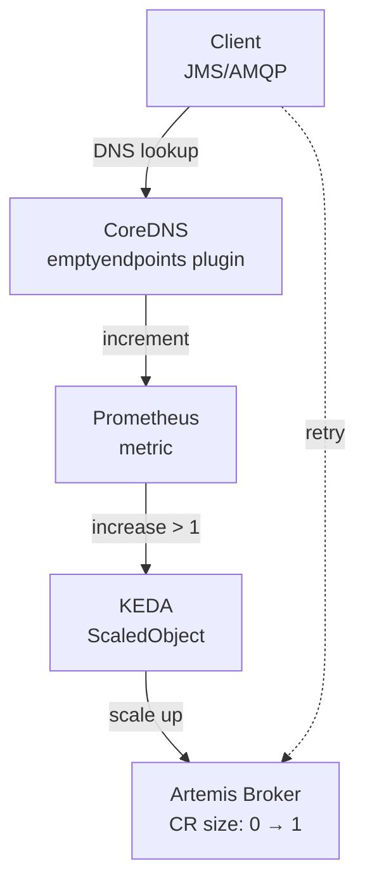

This tutorial demonstrates an approach to serverless messaging
using a custom CoreDNS plugin that detects DNS queries to services with no
endpoints. When a client tries to resolve the broker's headless service while
the broker is at zero, the plugin increments a Prometheus metric that KEDA uses
to trigger scale-up.

## How Does It Work?



**The flow:**

1. Client does DNS lookup for broker's headless service
2. CoreDNS plugin detects query to service with no endpoints
3. Plugin increments `coredns_emptyendpoints_queries_total` metric
4. Prometheus scrapes the metric
5. KEDA detects `increase() > 1` → scales broker CR to 1
6. Broker starts and becomes ready
7. Client retries DNS lookup → resolves to broker pod
8. Client connects successfully!

## Key Requirements

| Requirement | Configuration |
|-------------|---------------|
| **Custom CoreDNS** | Image with `emptyendpoints` plugin |
| **CoreDNS cache** | TTL reduced to 5s |
| **CoreDNS RBAC** | `get` verb for endpoints |
| **JVM DNS cache** | `networkaddress.cache.negative.ttl=0` |

## Table of Contents

* [Prerequisites](#prerequisites)
* [Install Dependencies](#install-dependencies)
* [Deploy Custom CoreDNS](#deploy-custom-coredns)
* [Deploy the Broker](#deploy-the-broker)
* [Configure KEDA](#configure-keda)
* [Test Scale-to-Zero](#test-scale-to-zero)
* [Test Scale-from-Zero](#test-scale-from-zero)
* [Troubleshooting](#troubleshooting)
* [Cleanup](#cleanup)

## Prerequisites

### Required Tools

* **kubectl** v1.28+
* **helm** v3.12+
* **minikube** v1.30+

### Start minikube

```{"stage":"init", "id":"minikube_start"}
minikube start --profile coredns-tutorial --memory=6144 --cpus=4
minikube profile coredns-tutorial
kubectl config use-context coredns-tutorial
```

### Create the namespace

```{"stage":"init", "label":"create namespace"}
kubectl create namespace serverless-broker
kubectl config set-context --current --namespace=serverless-broker
```

## Install Dependencies

### Install the ActiveMQ Artemis Operator

```{"stage":"init", "rootdir":"$initial_dir"}
./deploy/install_opr.sh
```

```{"stage":"init", "label":"wait for operator"}
kubectl wait deployment activemq-artemis-controller-manager --for=condition=Available --namespace=serverless-broker --timeout=240s
```

### Install KEDA

```{"stage":"init", "label":"install keda"}
helm repo add kedacore https://kedacore.github.io/charts
helm repo update
helm upgrade --install keda kedacore/keda --namespace keda --create-namespace --timeout 10m --wait
```

```{"stage":"init", "label":"verify keda"}
kubectl wait deployment keda-operator --namespace=keda --for=condition=Available --timeout=300s
kubectl wait deployment keda-operator-metrics-apiserver --namespace=keda --for=condition=Available --timeout=300s
```

### Install Prometheus

```{"stage":"init", "runtime":"bash", "label":"install prometheus"}
helm repo add prometheus-community https://prometheus-community.github.io/helm-charts
helm upgrade -i prometheus prometheus-community/kube-prometheus-stack \
  -n serverless-broker \
  --set prometheus.prometheusSpec.serviceMonitorSelectorNilUsesHelmValues=false \
  --set prometheus.prometheusSpec.podMonitorSelectorNilUsesHelmValues=false \
  --set kubeEtcd.enabled=false \
  --set kubeControllerManager.enabled=false \
  --set kubeScheduler.enabled=false \
  --timeout 10m --wait
```

```{"stage":"init", "label":"wait for prometheus"}
kubectl wait deployment prometheus-kube-prometheus-operator --for=condition=Available --namespace=serverless-broker --timeout=300s
```

## Deploy Custom CoreDNS

The custom CoreDNS image includes the `emptyendpoints` plugin that detects DNS
queries to services with no ready endpoints and exports a Prometheus metric.

> **Note**: The plugin source is available at
> [github.com/lavocatt/artemis-coredns-plugin](https://github.com/lavocatt/artemis-coredns-plugin)

### Update CoreDNS Image

Replace the stock CoreDNS with our custom image:

```{"stage":"coredns", "label":"update coredns image"}
kubectl set image deployment/coredns coredns=quay.io/tlavocat/artemis-coredns-plugin:v1.11.1-v3 -n kube-system
kubectl rollout status deployment/coredns -n kube-system --timeout=120s
```

### Configure CoreDNS with Plugin

Update the Corefile to enable the plugin. The `emptyendpoints` plugin wraps the
ResponseWriter to intercept NXDOMAIN responses from downstream plugins:

```{"stage":"coredns", "label":"configure corefile"}
kubectl patch configmap coredns -n kube-system --type='json' -p='[{"op":"replace","path":"/data/Corefile","value":".:53 {\n    log\n    errors\n    health {\n       lameduck 5s\n    }\n    ready\n    emptyendpoints serverless-broker\n    kubernetes cluster.local in-addr.arpa ip6.arpa {\n       pods insecure\n       fallthrough in-addr.arpa ip6.arpa\n       ttl 5\n    }\n    prometheus :9153\n    forward . /etc/resolv.conf {\n       max_concurrent 1000\n    }\n    cache 5 {\n       success 1000 5\n       denial 1000 5\n    }\n    loop\n    reload\n    loadbalance\n}\n"}]'
kubectl rollout restart deployment/coredns -n kube-system
kubectl rollout status deployment/coredns -n kube-system --timeout=60s
```

### Verify CoreDNS Restart

Ensure CoreDNS is running with the new configuration:

```{"stage":"coredns", "runtime":"bash", "label":"verify coredns"}
kubectl rollout status deployment/coredns -n kube-system --timeout=60s
kubectl get pods -n kube-system -l k8s-app=kube-dns
```

### Create ServiceMonitor for CoreDNS

Tell Prometheus to scrape CoreDNS metrics:

```{"stage":"coredns", "runtime":"bash", "label":"coredns servicemonitor"}
kubectl apply -f - <<EOF
apiVersion: monitoring.coreos.com/v1
kind: ServiceMonitor
metadata:
  name: coredns-emptyendpoints
  namespace: serverless-broker
  labels:
    release: prometheus
spec:
  namespaceSelector:
    matchNames:
    - kube-system
  selector:
    matchLabels:
      k8s-app: kube-dns
  endpoints:
  - port: metrics
    interval: 5s
EOF
```

Verify the CoreDNS plugin is loaded:

```{"stage":"coredns", "runtime":"bash", "label":"verify plugin"}
kubectl port-forward -n kube-system deployment/coredns 9153:9153 &
PF_PID=$!
sleep 3
curl -s http://localhost:9153/metrics | grep 'coredns_plugin_enabled.*emptyendpoints' || echo "Plugin not loaded"
kill $PF_PID 2>/dev/null || true
```

Wait for Prometheus to discover and scrape CoreDNS metrics:

```{"stage":"coredns", "runtime":"bash", "label":"wait for prometheus scrape"}
echo "Waiting for Prometheus to discover CoreDNS metrics..."
TIMEOUT=120
ELAPSED=0
while [ $ELAPSED -lt $TIMEOUT ]; do
  RESULT=$(kubectl exec -n serverless-broker \
    $(kubectl get pod -n serverless-broker -l app.kubernetes.io/name=prometheus -o jsonpath='{.items[0].metadata.name}') -- \
    wget -q -O- 'http://localhost:9090/api/v1/query?query=coredns_plugin_enabled' 2>/dev/null || echo "")
  
  if echo "$RESULT" | grep -q '"emptyendpoints"'; then
    echo "Prometheus is scraping CoreDNS metrics!"
    exit 0
  fi
  
  echo "$(date +%H:%M:%S) - Waiting for Prometheus... ($ELAPSED/$TIMEOUT s)"
  sleep 10
  ELAPSED=$((ELAPSED + 10))
done

echo "Prometheus did not discover CoreDNS metrics within ${TIMEOUT}s"
exit 1
```

## Deploy the Broker

Deploy a simple broker with an AMQP acceptor:

```{"stage":"deploy", "runtime":"bash", "label":"deploy broker"}
kubectl apply -f - <<EOF
apiVersion: broker.amq.io/v1beta1
kind: ActiveMQArtemis
metadata:
  name: serverless-broker
  namespace: serverless-broker
spec:
  deploymentPlan:
    size: 1
    messageMigration: false
  acceptors:
  - name: all
    protocols: all
    port: 61616
  adminUser: admin
  adminPassword: admin
  brokerProperties:
  - addressConfigurations.test-queue.queueConfigs.test-queue.routingType=ANYCAST
EOF
```

```{"stage":"deploy", "runtime":"bash", "label":"wait for broker"}
kubectl wait ActiveMQArtemis serverless-broker \
  --for=condition=Ready --namespace=serverless-broker --timeout=300s
kubectl get pods -n serverless-broker -l ActiveMQArtemis=serverless-broker
```

## Configure KEDA

Create a ScaledObject that scales based on the CoreDNS plugin metric.

> **Important**: The Prometheus queries filter by `exported_namespace` and `exported_service`
> labels to ensure each broker only scales based on its OWN DNS queries. Without these filters,
> multiple brokers would all scale up when ANY broker receives connection attempts.

```{"stage":"scaling", "runtime":"bash", "label":"create scaledobject"}
kubectl apply -f - <<EOF
apiVersion: keda.sh/v1alpha1
kind: ScaledObject
metadata:
  name: serverless-broker-scaler
  namespace: serverless-broker
spec:
  scaleTargetRef:
    apiVersion: broker.amq.io/v1beta1
    kind: ActiveMQArtemis
    name: serverless-broker
  minReplicaCount: 0
  maxReplicaCount: 1
  cooldownPeriod: 120
  pollingInterval: 5
  triggers:
    # Scale FROM zero: DNS queries to THIS broker's headless service with no endpoints
    # Filter by exported_namespace and exported_service to target only this broker
    - type: prometheus
      metadata:
        serverAddress: http://prometheus-kube-prometheus-prometheus.serverless-broker.svc:9090
        metricName: coredns_emptyendpoints
        query: |
          sum(increase(coredns_emptyendpoints_queries_total{
            exported_namespace="serverless-broker",
            exported_service="serverless-broker-hdls-svc"
          }[5m])) or vector(0)
        threshold: "1"
      metricType: AverageValue
    
    # Scale TO zero: No connections AND no pending messages on THIS broker
    # Filter by namespace label to target only this broker's metrics
    - type: prometheus
      metadata:
        serverAddress: http://prometheus-kube-prometheus-prometheus.serverless-broker.svc:9090
        query: |
          (sum(artemis_connection_count{namespace="serverless-broker"}) or vector(0)) +
          (sum(artemis_total_pending_message_count{namespace="serverless-broker"}) or vector(0))
        threshold: "1"
      metricType: AverageValue
EOF
```

```{"stage":"scaling", "runtime":"bash", "label":"verify scaledobject"}
kubectl wait scaledobject serverless-broker-scaler \
  --for=condition=Ready --namespace=serverless-broker --timeout=120s
kubectl get scaledobject serverless-broker-scaler -n serverless-broker
```

## Test Scale-to-Zero

Wait for KEDA to scale the broker to zero:

```{"stage":"test-scaledown", "runtime":"bash", "label":"wait for scale to zero"}
TIMEOUT=300
ELAPSED=0
while [ $ELAPSED -lt $TIMEOUT ]; do
  CR_SIZE=$(kubectl get activemqartemis serverless-broker -n serverless-broker \
    -o jsonpath='{.spec.deploymentPlan.size}' 2>/dev/null || echo "1")
  PODS=$(kubectl get pods -n serverless-broker -l ActiveMQArtemis=serverless-broker \
    --no-headers 2>/dev/null | wc -l)
  
  echo "$(date +%H:%M:%S) - CR size: ${CR_SIZE}, Pods: ${PODS}"
  
  if [ "${CR_SIZE}" = "0" ] && [ "${PODS}" = "0" ]; then
    exit 0
  fi
  sleep 15
  ELAPSED=$((ELAPSED + 15))
done

echo "Broker did not scale to zero within ${TIMEOUT}s"
exit 1
```

## Test Scale-from-Zero

The key to this approach: **disable JVM DNS caching** so each retry does a new
DNS lookup, triggering the CoreDNS plugin metric.

### Run Producer and Monitor Scaling

The Artemis Core client supports native reconnection with the URL format
`(tcp://host:port)?initialConnectAttempts=N&retryInterval=MS`. Each retry
triggers a fresh DNS lookup, which increments the CoreDNS metric and causes
KEDA to scale up the broker.

```{"stage":"demo", "runtime":"bash", "label":"run producer"}
kubectl run artemis-producer --rm -i --restart=Never \
  --image=quay.io/artemiscloud/activemq-artemis-broker-kubernetes:artemis.2.33.0 \
  -n serverless-broker -- \
  /bin/bash -c '
    # Disable JVM DNS cache so each reconnect does a fresh DNS lookup
    echo "networkaddress.cache.ttl=0" > /tmp/dns.security
    echo "networkaddress.cache.negative.ttl=0" >> /tmp/dns.security
    export JAVA_ARGS="-Djava.security.properties=/tmp/dns.security"

    echo "Starting producer with Artemis Core reconnect..."
    echo "Each retry triggers a DNS lookup -> CoreDNS metric -> KEDA scales broker"

    # Artemis Core URL with reconnect parameters:
    # - initialConnectAttempts=30: retry up to 30 times before first connection
    # - retryInterval=10000: wait 10 seconds between retries
    /opt/amq/bin/artemis producer \
      --url "(tcp://serverless-broker-hdls-svc.serverless-broker.svc.cluster.local:61616)?initialConnectAttempts=30&retryInterval=10000" \
      --destination queue://test-queue \
      --message-count 1 \
      --message "Hello from serverless!" \
      --verbose
  '
```

### Verify the Message

If the producer succeeded, the broker was scaled from zero and the message is in the queue:

```{"stage":"demo", "runtime":"bash", "label":"check queue"}
echo "=== Verifying message in queue ==="
kubectl run check-queue --rm -i --restart=Never \
  --image=quay.io/artemiscloud/activemq-artemis-broker-kubernetes:artemis.2.33.0 \
  -n serverless-broker -- \
  timeout 30 /opt/amq/bin/artemis queue stat \
    --url "tcp://serverless-broker-hdls-svc.serverless-broker.svc.cluster.local:61616" \
    --queueName test-queue 2>&1 | grep -E "test-queue|MESSAGE|NAME"

echo ""
echo "=== Scale-from-zero SUCCESS ==="
echo "The broker was at zero replicas, a client connection triggered KEDA via CoreDNS metrics,"
echo "the broker scaled up, and the message was delivered!"
```

## Troubleshooting

### CoreDNS Plugin Not Working

```bash
# Check plugin is loaded
kubectl port-forward -n kube-system deployment/coredns 9153:9153 &
curl -s http://localhost:9153/metrics | grep emptyendpoints

# Check CoreDNS logs
kubectl logs -n kube-system -l k8s-app=kube-dns --tail=50

# Verify RBAC has 'get' permission
kubectl get clusterrole system:coredns -o yaml | grep -A5 "verbs:"
```

### Metric Not Incrementing

```bash
# Trigger a DNS lookup manually
kubectl run dns-test --rm -i --restart=Never --image=busybox -n serverless-broker -- \
  nslookup serverless-broker-hdls-svc.serverless-broker.svc.cluster.local

# Check metric
kubectl port-forward -n kube-system deployment/coredns 9153:9153 &
curl -s http://localhost:9153/metrics | grep emptyendpoints_queries_total
```

### KEDA Not Scaling

```bash
# Check KEDA can read metric
kubectl logs -n keda deployment/keda-operator --tail=30 | grep -i error

# Test Prometheus query
kubectl exec -n serverless-broker \
  $(kubectl get pod -n serverless-broker -l app.kubernetes.io/name=prometheus -o jsonpath='{.items[0].metadata.name}') -- \
  wget -q -O- 'http://localhost:9090/api/v1/query?query=coredns_emptyendpoints_queries_total'
```

## Cleanup

```{"stage":"teardown", "requires":"init/minikube_start"}
minikube delete --profile coredns-tutorial
```

## Conclusion

The CoreDNS plugin approach provides **DNS-layer detection** for scale-from-zero:

1. **No extra pods** - The plugin runs inside existing CoreDNS
2. **Transparent to clients** - Works at the DNS resolution level
3. **Requires JVM tuning** - `networkaddress.cache.negative.ttl=0` is essential
